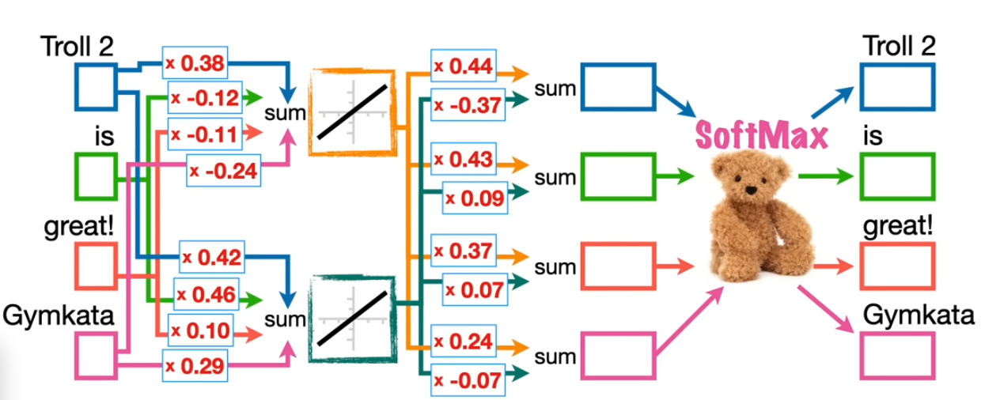
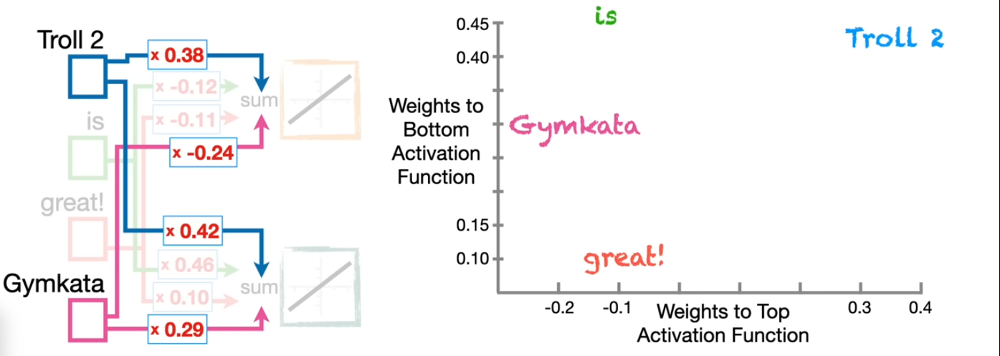
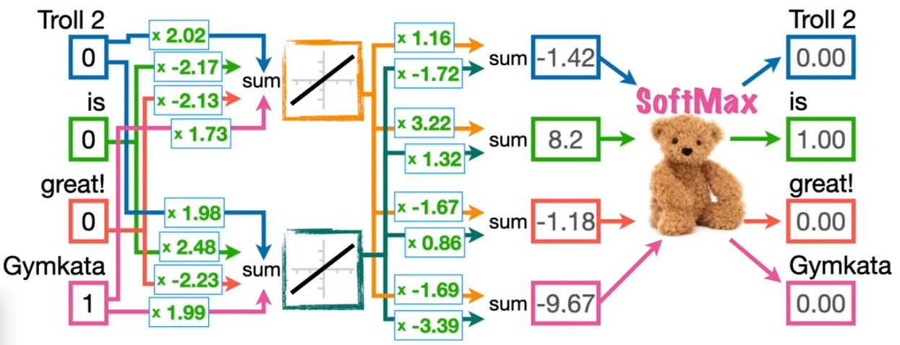
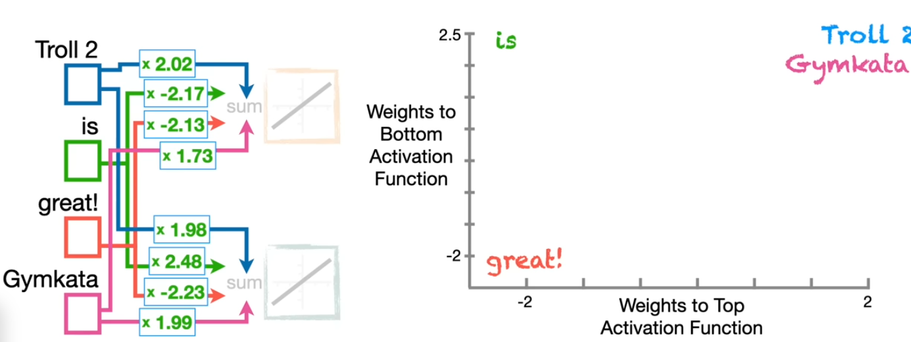
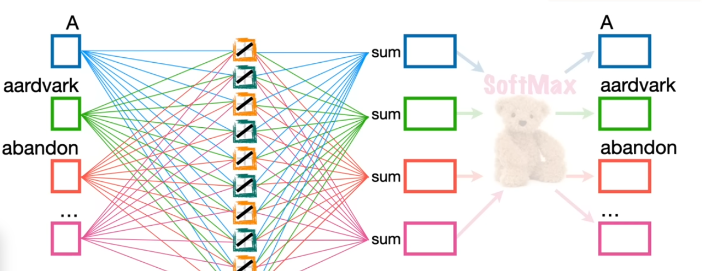
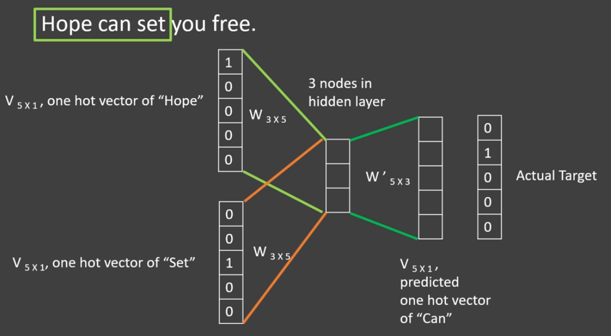
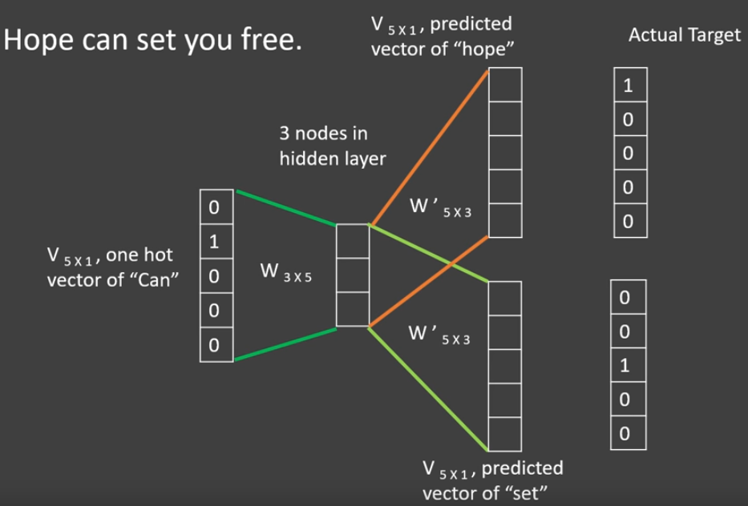

# NLP - Natural Language Processing

--

## Definition

**Natural Language Processing** (NLP) is the field of study that focuses on the **interaction between computers and humans** through the *natural language*.

Notes:
- **Goal**: To enable computers to understand, interpret, and generate human languages in a valuable way.
- **Applications**: Machine translation, sentiment analysis, speech recognition, chatbots, and more.

--

## ELIZA

```text
 User: I am unhappy.
 ELIZA: DO YOU THINK COMING HERE WILL HELP YOU NOT TO BE UNHAPPY
 User: I need some help, that much seems certain.
 ELIZA: WHAT WOULD IT MEAN TO YOU IF YOU GOT SOME HELP
 User: Perhaps I could learn to get along with my mother.
 ELIZA: TELL ME MORE ABOUT YOUR FAMILY
 User: My mother takes care of me.
 ELIZA: WHO ELSE IN YOU FAMILY TAKES CARE OF YOU
 User: My father.
 ELIZA: YOUR FATHER
 User: You are like my father in some ways.
```

<small style="font-size:xx-small; float:right">Weizenbaum, J. 1966. ELIZA – A computer program for the study of natural language communication between man and machine. CACM, 9(1):36–45.</small>

Notes:
The dialogue above is from ELIZA, an **early natural language processing system** ELIZA that could carry on a limited conversation with a user by **imitating the responses of a Rogerian psychotherapist (Weizenbaum, 1966)**. ELIZA is a surprisingly simple program that uses pattern matching to recognize phrases like “I need X” and translate them into suitable outputs like “What would it mean to you if you got X?”. This simple technique succeeds in this domain because ELIZA doesn’t actually need to know anything to mimic a Rogerian psychotherapist. As Weizenbaum notes, this is one of the few dialogue genres where listeners can act as if they know nothing of the world. ELIZA’s mimicry of human conversation was remarkably successful: **many people who interacted with ELIZA came to believe that it really understood them and their problems, many continued to believe in ELIZA’s abilities even after the program’s operation was explained to them (Weizenbaum, 1976)**, and even today such chatbots are a fun diversion.

--

<!-- .slide: class="align-center" -->

## Regular Expressions


Notes:
We’ll begin with the most important tool for describing text patterns: the regular expression. Regular expressions can be used to specify strings we might want to extract from a document, from transforming “I need X” in ELIZA above, to defining strings like $199 or $24.99 for extracting tables of prices from a document

Regular expressions are particularly useful for **searching in texts**, when we have a **pattern to search** for and a corpus of texts to search through. A regular expression search function will search through the corpus, returning all texts that match the pattern.

--

## Rule-based Chatbots

Rule-based Chatbots like ELIZA works by having a series or **cascade of regular expression substitutions** each of which matches and changes some part of the input line.

```text
s/.* YOU ARE (depressed|sad) .*/I AM SORRY TO HEAR YOU ARE \1/ 
s/.* YOU ARE (depressed|sad) .*/WHY DO YOU THINK YOU ARE \1/ 
s/.* all .*/IN WHAT WAY/ 
s/.* always .*/CAN YOU THINK OF A SPECIFIC EXAMPLE/
```

<small style="font-size:xx-small"> [Rule Based Chatbot Example](https://colab.research.google.com/drive/1yph2YtXs-6a08gwf4MymHBVlPEebva_y?usp=sharing) </small>


--

# NLP Pipeline

<ol>
   <li class="fragment fade-in-then-semi-out">
      <strong>Data Collection</strong>: Gathering raw text data.
   </li>
   <li class="fragment fade-in-then-semi-out">
      <strong>Text Preprocessing</strong>: Cleaning and preparing text data (Tokenization, stemming, lemmatization, removing stop words, ... )
   </li>
   <li class="fragment fade-in-then-semi-out">
      <strong>Feature Extraction</strong>: Converting text into a format understandable by machine learning algorithms (Bag of Words, TF-IDF, ... )
   </li>
   <li class="fragment fade-in-then-semi-out">
      <strong>Modeling</strong>: Applying algorithms to learn from data.
   </li>
   <li class="fragment fade-in-then-semi-out">
      <strong>Evaluation</strong>: Assessing the performance of the model.
   </li>
   <li class="fragment fade-in-then-semi-out">
      <strong>Deployment</strong>: Integrating the model into applications.
   </li>
</ol>

Notes:
The Natural Language Processing (NLP) pipeline refers to a **series of systematically arranged processes or steps** that are **followed to perform tasks involving the understanding, interpretation, and generation of human language** by computers. An NLP pipeline translates raw text into a form that machines can understand and analyze, facilitating various applications such as sentiment analysis, language translation, and question-answering systems.
1. Text Acquisition : Gathering text data, which could come from various sources like websites, books, social media, etc.
2. Pre-processing: Cleaning and normalizing the text. This includes tasks like removing unnecessary characters, correcting typos, converting text to lowercase, etc.
3. Feature Extraction: Converting tokens to numerical representations through embeddings, where words with similar meanings are mapped to points close to each other in a geometrical space. This facilitates the machine's understanding of semantic similarities between words.
4. Modelling: Using the processed data to train machine learning or deep learning models for specific tasks (e.g., classification, regression). After training, the model is evaluated to determine its accuracy, precision, recall, and other metrics.

--

<!-- .slide: class="align-center" -->


# Text Preprocessing


<small style="font-size:xx-small"> [Word Sense Disambiguation: A Survey](https://www.researchgate.net/publication/220566219_Word_Sense_Disambiguation_A_Survey) </small>


Notes:
- **Tokenization**: Splitting text into sentences or words.
- **Stemming**: Reducing words to their base form.
- **Lemmatization**: Similar to stemming, but returns real words.
- **Removing Stop Words**: Eliminating common words that carry less important meaning.
- **Normalization**: Converting all text to a consistent format (e.g., lowercasing).

--


# Feature Extraction 

- **Bag of Words (BoW)**: Represents text as an unordered collection of words and associates a frequencies. 
- **Term Frequency-Inverse Document Frequency (TF-IDF)**: Reflects the importance of a word to a document in a collection.

Notes:
- While both Bag-of-Words and TF-IDF have been popular in their own regard, there still remained **a void where understanding the context of words** was concerned. Detecting the similarity between the words ‘spooky’ and ‘scary’, or translating our given documents into another language, requires a lot more information on the documents.

--

<!-- .slide: class="align-center" -->

## Feature Extraction - Word Embeddings

<p class="fragment fade-out" data-fragment-index=0 >
   Training Data: "Troll 2 is great!" and "Gymkata is great!"
</p>
<div class="r-stack">
    
    
    
    
</div>

<small style="font-size:xx-small"> [Word Embedding and Word2Vec, Clearly Explained!!!](https://www.youtube.com/watch?v=viZrOnJclY0) </small>


Notes:
- Word embeddings are a type of word representation that allows words to be represented as vectors in a continuous vector space.
- Unlike BoW and YTF-IDF, embeddings **capture semantic meaning and relationships between words**.
- Improve performance of NLP models.
- Reduce dimensionality compared to sparse representations.
- A **simple neural network** can automate the assignment of numbers to words, taking into account their context and usage. This network, through a process involving weights and activation functions, **learns to predict the next word in a sentence**. **The weights, adjusted through backpropagation, become the embeddings** that capture semantic relationships between words.

--

<!-- .slide: class="align-center" -->


## Word Embeddings - Word2Vec

<p class="fragment fade-out" data-fragment-index=0 >
   Training Data: Wikipedia, Books, ...
</p>
<div class="r-stack">
    
    
    
</div>

<small style="font-size:xx-small"> [Word Embedding and Word2Vec, Clearly Explained!!!](https://www.youtube.com/watch?v=viZrOnJclY0) </small>
<small style="font-size:xx-small"> [Word2Vec - Skipgram and CBOW](https://www.youtube.com/watch?app=desktop&v=UqRCEmrv1gQ) </small>


Notes:
- Is a popular tool that utilizes neural networks to create word embeddings. It employs two main strategies to enrich the context in which words are understood: Continuous Bag-of-Words (CBOW) and Skip-Gram. **CBOW predicts a word based on its context**, while **Skip-Gram predicts the context from a word**.
- Word2Vec can use a large number of activation functions (often 100 or more) to create detailed embeddings for each word, trained on extensive datasets like the entirety of Wikipedia. This approach results in a vast vocabulary and a high number of weights to optimize, making training resource-intensive.


--

## What is a Language Model?

> A language model is a *statistical and computational algorithm* that enables a computer to understand, interpret, and generate human language based on the likelihood of occurrence of words and sequences of words. 

--

## Statistical Language Models

These earlier models rely on the **statistical properties** of language, using the probabilities of sequences of words (n-grams) to predict the likelihood of the next word in a sequence.

<small style="font-size:xx-small"> [Bigrams Example](https://colab.research.google.com/drive/1ikJuNYOOliuy8tTl9csKuWDlVdHJhVQg?usp=sharing) </small>


--


## Neural Language Models

These models use **neural networks** to predict the likelihood of a sequence of words, learning and representing language in high-dimensional spaces. 

<small style="font-size:xx-small"> [NLM Example](https://colab.research.google.com/drive/1ON9CO6LUtX1mbDmYIq3Pt5mSqoxzGxPr?usp=sharing) </small>


