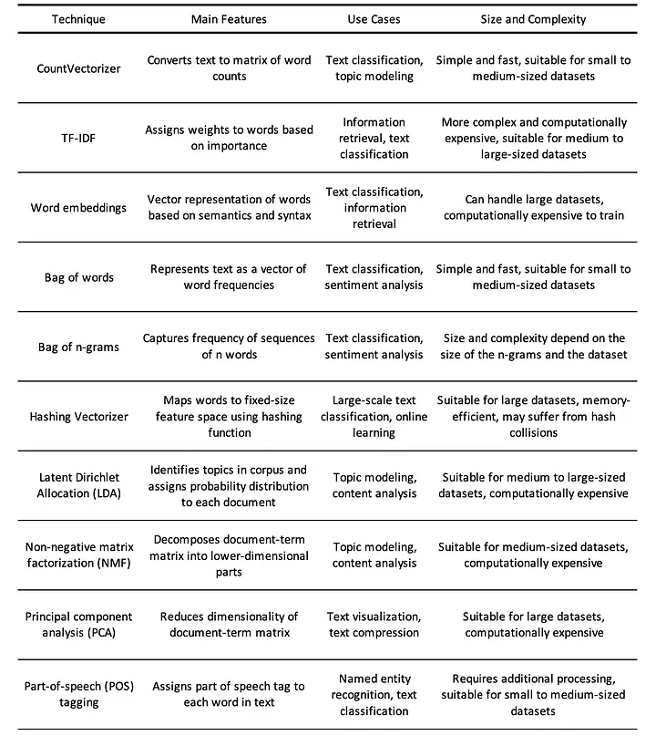

# Natural Language Processing

<!-- .slide: data-background-image="assets/matrix.gif" -->

--

## Definition

**Natural Language Processing** (NLP) is the field of study that focuses on the **interaction between computers and humans** through the *natural language*.

Notes:
- **Goal**: To enable computers to understand, interpret, and generate human languages in a valuable way.
- **Applications**: Machine translation, sentiment analysis, speech recognition, chatbots, and more.

--

## ELIZA

```text
 User: I am unhappy.
 ELIZA: DO YOU THINK COMING HERE WILL HELP YOU NOT TO BE UNHAPPY
 User: I need some help, that much seems certain.
 ELIZA: WHAT WOULD IT MEAN TO YOU IF YOU GOT SOME HELP
 User: Perhaps I could learn to get along with my mother.
 ELIZA: TELL ME MORE ABOUT YOUR FAMILY
 User: My mother takes care of me.
 ELIZA: WHO ELSE IN YOU FAMILY TAKES CARE OF YOU
 User: My father.
 ELIZA: YOUR FATHER
 User: You are like my father in some ways.
```

<small style="font-size:xx-small; float:right">Weizenbaum, J. 1966. ELIZA – A computer program for the study of natural language communication between man and machine. CACM, 9(1):36–45.</small>

Notes:
The dialogue above is from ELIZA, an **early natural language processing system** ELIZA that could carry on a limited conversation with a user by **imitating the responses of a Rogerian psychotherapist (Weizenbaum, 1966)**. ELIZA is a surprisingly simple program that uses pattern matching to recognize phrases like “I need X” and translate them into suitable outputs like “What would it mean to you if you got X?”. This simple technique succeeds in this domain because ELIZA doesn’t actually need to know anything to mimic a Rogerian psychotherapist. As Weizenbaum notes, this is one of the few dialogue genres where listeners can act as if they know nothing of the world. ELIZA’s mimicry of human conversation was remarkably successful: **many people who interacted with ELIZA came to believe that it really understood them and their problems, many continued to believe in ELIZA’s abilities even after the program’s operation was explained to them (Weizenbaum, 1976)**, and even today such chatbots are a fun diversion.

--

## Rule-based Chatbots

Rule-based Chatbots like ELIZA works by having a series or **cascade of regular expression substitutions** each of which matches and changes some part of the input line.

```text
s/.*(unhappy|depressed|sad).*/I AM SORRY TO HEAR YOU ARE \1/ 
s/.*(unhappy|depressed|sad).*/WHY DO YOU THINK YOU ARE \1/ 
s/.*I need some help.*/WHAT WOULD IT MEAN TO YOU IF YOU GOT SOME HELP/ 
```

<small style="font-size:xx-small"> [Rule Based Chatbot Example](https://colab.research.google.com/drive/1yph2YtXs-6a08gwf4MymHBVlPEebva_y?usp=sharing) </small>


--

# NLP Pipeline

<ol>
   <li class="fragment fade-in-then-semi-out">
      <strong>Data Collection</strong>: Gathering raw text data.
   </li>
   <li class="fragment fade-in-then-semi-out">
      <strong>Text Preprocessing</strong>: Cleaning and preparing text data (Tokenization, stemming, lemmatization, removing stop words, ... )
   </li>
   <li class="fragment fade-in-then-semi-out">
      <strong>Feature Extraction</strong>: Converting text into a format understandable by machine learning algorithms 
   </li>
   <li class="fragment fade-in-then-semi-out">
      <strong>Modeling</strong>: Applying algorithms to learn from data.
   </li>
   <li class="fragment fade-in-then-semi-out">
      <strong>Evaluation</strong>: Assessing the performance of the model.
   </li>
   <li class="fragment fade-in-then-semi-out">
      <strong>Deployment</strong>: Integrating the model into applications.
   </li>
</ol>

Notes:
The Natural Language Processing (NLP) pipeline refers to a **series of systematically arranged processes or steps** that are **followed to perform tasks involving the understanding, interpretation, and generation of human language** by computers. An NLP pipeline translates raw text into a form that machines can understand and analyze, facilitating various applications such as sentiment analysis, language translation, and question-answering systems.
1. Text Acquisition : Gathering text data, which could come from various sources like websites, books, social media, etc.
2. Pre-processing: Cleaning and normalizing the text. This includes tasks like removing unnecessary characters, correcting typos, converting text to lowercase, etc.
3. Feature Extraction: Converting tokens to numerical representations through embeddings, where words with similar meanings are mapped to points close to each other in a geometrical space. This facilitates the machine's understanding of semantic similarities between words.
4. Modelling: Using the processed data to train machine learning or deep learning models for specific tasks (e.g., classification, regression). After training, the model is evaluated to determine its accuracy, precision, recall, and other metrics.

--

<!-- .slide: class="align-center" -->


# Text Preprocessing


<small style="font-size:xx-small"> [Word Sense Disambiguation: A Survey](https://www.researchgate.net/publication/220566219_Word_Sense_Disambiguation_A_Survey) </small>


Notes:
- **Tokenization**: Splitting text into sentences or words.
- **Stemming**: Reducing words to their base form.
- **Lemmatization**: Similar to stemming, but returns real words.
- **Removing Stop Words**: Eliminating common words that carry less important meaning.
- **Normalization**: Converting all text to a consistent format (e.g., lowercasing).

--

<!-- .slide: class="align-center" -->

# Feature Extraction 



<small style="font-size:xx-small">[Exploring Feature Extraction Techniques for Natural Language Processing](https://medium.com/@eskandar.sahel/exploring-feature-extraction-techniques-for-natural-language-processing-46052ee6514)</small>

Notes:
feature extraction is a fundamental task that involves converting raw text data into a format that can be easily processed by machine learning algorithms.

--

## What is a Language Model?

> A language model is a *statistical and computational algorithm* that enables a computer to understand, interpret, and generate human language based on the likelihood of occurrence of words and sequences of words. 

--

## Statistical Language Models

These earlier models rely on the **statistical properties** of language, using the probabilities of sequences of words (n-grams) to predict the likelihood of the next word in a sequence.

<small style="font-size:xx-small"> [Bigrams Example](https://colab.research.google.com/drive/1ikJuNYOOliuy8tTl9csKuWDlVdHJhVQg?usp=sharing) </small>


--


## Neural Language Models

These models use **neural networks** to predict the likelihood of a sequence of words, learning and representing language in high-dimensional spaces. 

<small style="font-size:xx-small"> [NLM Example](https://colab.research.google.com/drive/1ON9CO6LUtX1mbDmYIq3Pt5mSqoxzGxPr?usp=sharing) </small>


--

## Questions Time

--

## Qual è l'obiettivo principale del Natural Language Processing (NLP)?

**A**) Tradurre dati binari in linguaggio umano  
**B**) Abilitare i computer a comprendere, interpretare e generare il linguaggio umano  
**C**) Progettare interfacce utente interattive  
**D**) Ottimizzare l'hardware per l'elaborazione del linguaggio  

Notes:  
B

--

## Cosa rappresenta ELIZA nel contesto dell'NLP?

**A**) Un avanzato modello di rete neurale  
**B**) Un esempio storico di chatbot basato su regole che simula un terapeuta Rogeriano  
**C**) Un sistema per la traduzione automatica di testi  
**D**) Un algoritmo per l'analisi statistica dei testi  

Notes:  
B

--

## Quale di questi passaggi **NON** fa parte della tipica pipeline NLP?


**A**) Raccolta dei dati  

**B**) Estrazione delle caratteristiche  

**C**) Valutazione del modello  

**D**) Compilazione del codice  

Notes:  
D

--

## Quale tecnica di preprocessing consiste nel ridurre le parole alla loro forma base, spesso tramite la rimozione di suffissi?


**A**) Tokenizzazione  

**B**) Stemming  

**C**) Normalizzazione  

**D**) Rimozione dei Stop Words  

Notes:  
B

--

## Quale affermazione descrive correttamente un modello di linguaggio?


**A**) È un algoritmo che traduce il linguaggio umano in dati numerici senza considerare il contesto  

**B**) È un algoritmo statistico e computazionale che genera sequenze di parole basate sulla probabilità  

**C**) È un sistema che analizza esclusivamente la struttura grammaticale del linguaggio  

**D**) È un software per la traduzione automatica che utilizza regole fisse  

Notes:  
B

--

## Quale di questi passaggi **NON** fa parte del tipico processo della pipeline NLP?


**A**) Estrazione delle caratteristiche  

**B**) Modellazione  

**C**) Deployment  

**D**) Debugging del codice  

Notes:  
D
