# Attention

<!-- .slide: data-background-image="assets/attention.gif" -->

--

## Multiple Meanings

<!-- .slide: class="align-center" -->

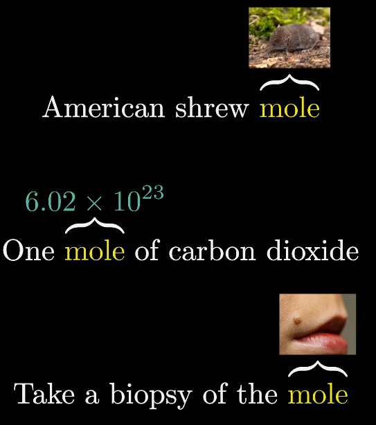

Notes:

Consider the phrases American shrew mole, one mole of carbon dioxide,  
and take a biopsy of the mole.  
You and I know that the word mole has different meanings in each one of these,  
based on the context.

--

## Token Embeddings

<!-- .slide: class="align-center" -->

Notes:

But after the first step of a transformer, the one that breaks up the text  
and associates each token with a vector, the vector that's associated with  
mole would be the same in all of these cases,  
because this initial token embedding is effectively a lookup table with no  
reference to the context.

--

## Meaning Directions

<!-- .slide: class="align-center" -->

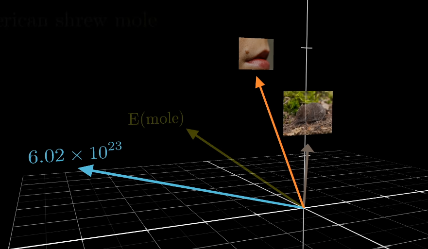

Notes:

The picture you might have in mind is that there are multiple distinct directions in  
this embedding space encoding the multiple distinct meanings of the word mole,  
and that

--

## Attention Refinement

<!-- .slide: class="align-center" -->

Notes:

a well-trained attention block calculates what you need to add to the generic  
embedding to move it to one of these specific directions, as a function of the context.

--

## Generic Embeddings

<!-- .slide: class="align-center" -->

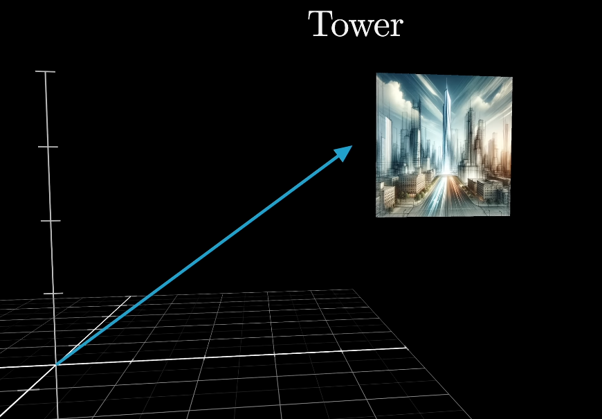

Notes:

To take another example, consider the embedding of the word tower.  
This is presumably some very generic, non-specific direction in the space,  
associated with lots of other large, tall nouns.

--

## Contextual Update

<!-- .slide: class="align-center" -->

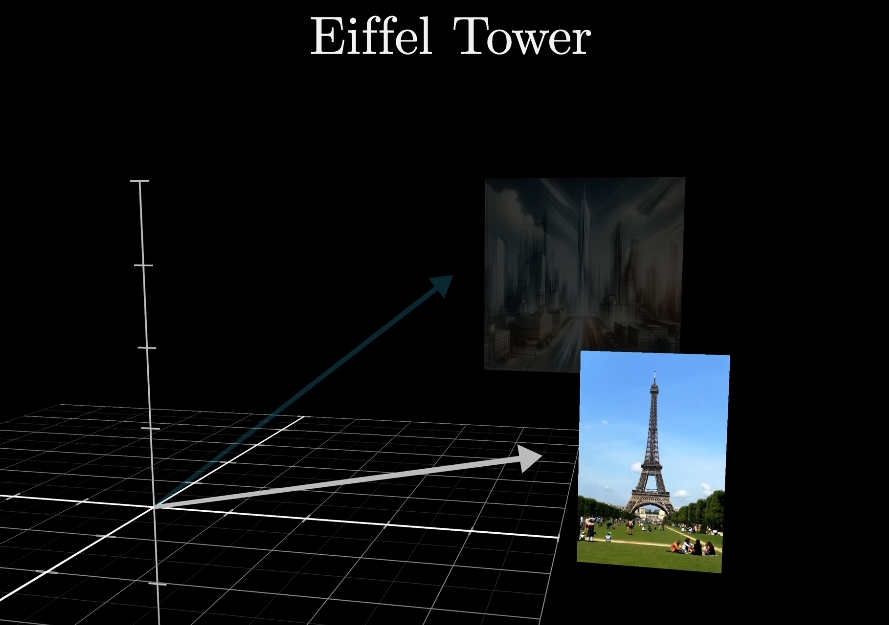

Notes:

If this word was immediately preceded by Eiffel,  
you could imagine wanting the mechanism to update this vector so that  
it points in a direction that more specifically encodes the Eiffel tower,  
maybe correlated with vectors associated with Paris and France and things made of steel.

--

## Further Refinement

<!-- .slide: class="align-center" -->

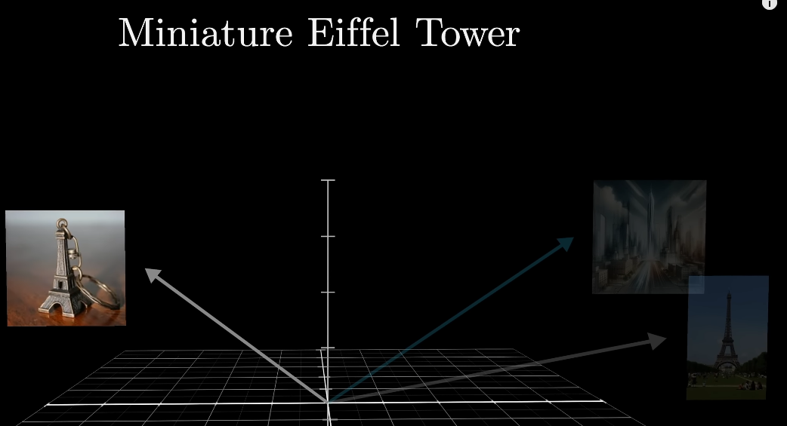

Notes:

If it was also preceded by the word miniature,  
then the vector should be updated even further,  
so that it no longer correlates with large, tall things.

--

## Information Transfer

<!-- .slide: class="align-center" -->

Notes:

More generally than just refining the meaning of a word,  
the attention block allows the model to move information encoded in  
one embedding to that of another, potentially ones that are quite far away,  
and potentially with information that's much richer than just a single word.

--

## Global Context

<!-- .slide: class="align-center" -->

Notes:

Imagine, for example, that the text you input is most of an entire mystery novel,  
all the way up to a point near the end, which reads, therefore the murderer was.  
If the model is going to accurately predict the next word,  
that final vector in the sequence, which began its life simply embedding the word was,  
will have to have been updated by all of the attention blocks to represent much,  
much more than any individual word, somehow encoding all of the information  
from the full context window that's relevant to predicting the next word.

--

## Context Influence

<!-- .slide: class="align-center" -->

Notes:

To step through the computations, though, let's take a much simpler example.  
Imagine that the input includes the phrase, a  
fluffy blue creature roamed the verdant forest.  
And for the moment, suppose that the only type of update that we care about  
is having the adjectives adjust the meanings of their corresponding nouns.

--

## Position Encoding

<!-- .slide: class="align-center" -->

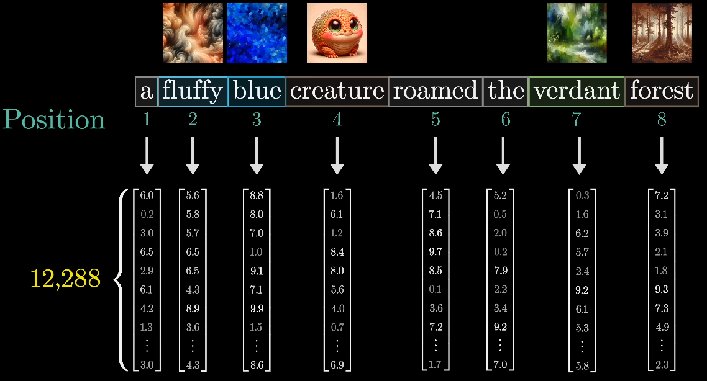

Notes:

Again, the initial embedding for each word is some high dimensional vector  
that only encodes the meaning of that particular word with no context.  
Actually, that's not quite true.  
They also encode the position of the word.  
There's a lot more to say about the specific way that positions are encoded,  
but right now, all you need to know is that the entries of this vector are

--

## Embedding Refinement

<!-- .slide: class="align-center" -->

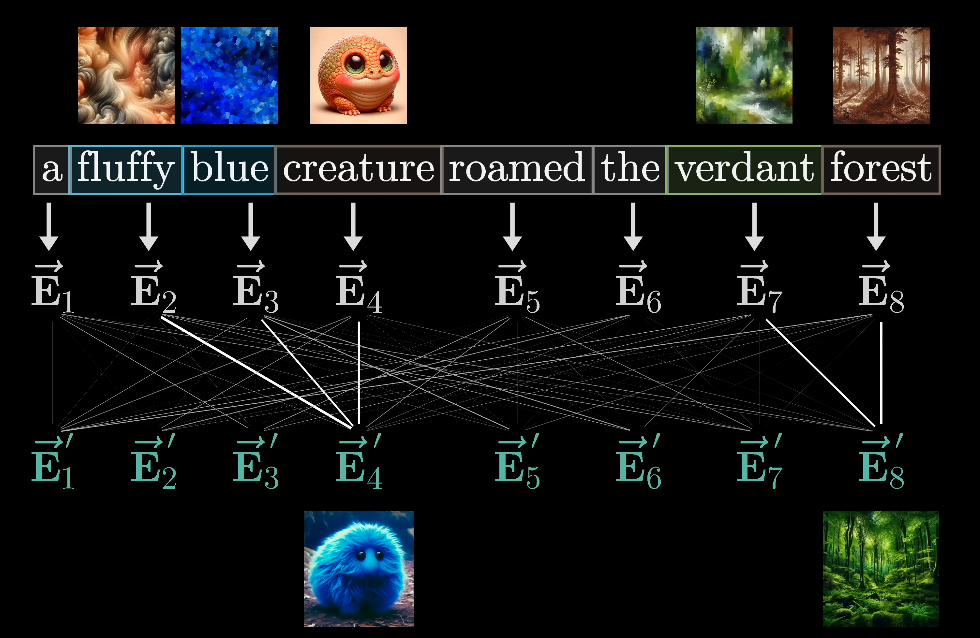

Notes:

The goal is to have a series of computations produce a new refined  
set of embeddings where, for example, those corresponding to the  
nouns have ingested the meaning from their corresponding adjectives.

--

## Matrix Operations

<!-- .slide: class="align-center" -->

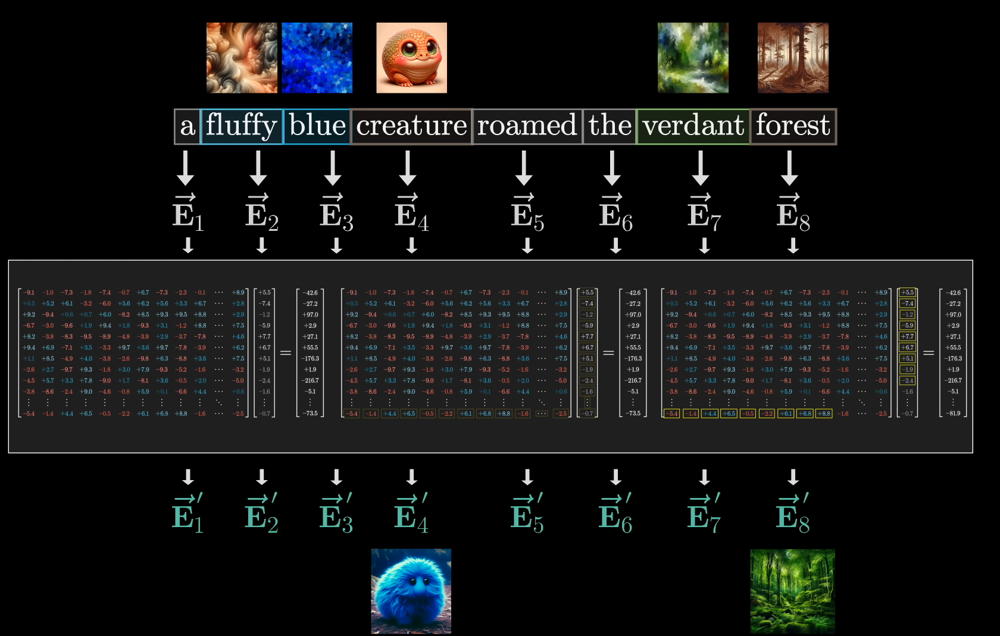

Notes:

And playing the deep learning game, we want most of the computations  
involved to look like matrix-vector products,  
where the matrices are full of tunable weights,  
things that the model will learn based on data.  
To be clear, I'm making up this example of adjectives updating nouns just to  
illustrate the type of behavior that you could imagine an attention head doing.  
As with so much deep learning, the true behavior is much harder to parse because it's  
based on tweaking and tuning a huge number of parameters to minimize some cost function.

--

## Queries

<!-- .slide: class="align-center" -->

Notes:

For the first step of this process, you might imagine each noun, like creature,  
asking the question, hey, are there any adjectives sitting in front of me?

--

## Responses

<!-- .slide: class="align-center" -->

Notes:

And for the words fluffy and blue, to each be able to answer,  
yeah, I'm an adjective and I'm in that position.

--

## Query Vector

<!-- .slide: class="align-center" -->

Notes:

That question is somehow encoded as yet another vector,  
another list of numbers, which we call the query for this word.  
This query vector though has a much smaller dimension than the embedding vector, say 128.

--

## Query Computation

<!-- .slide: class="align-center" -->

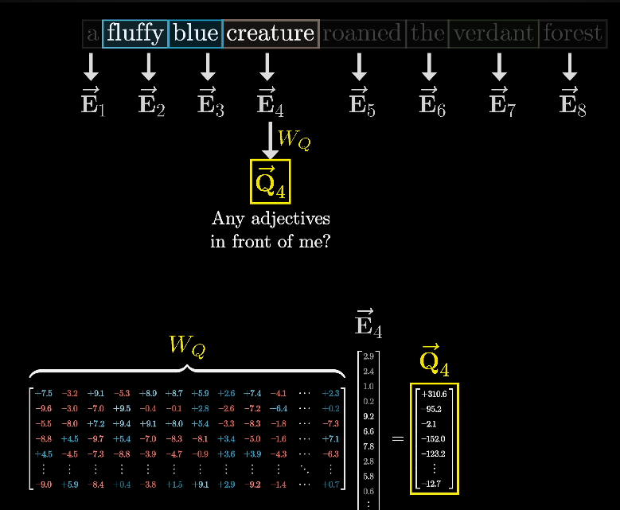

Notes:

Computing this query looks like taking a certain matrix,  
which I'll label wq, and multiplying it by the embedding.  
Compressing things a bit, let's write that query vector as q,

--

## Token Querying

<!-- .slide: class="align-center" -->

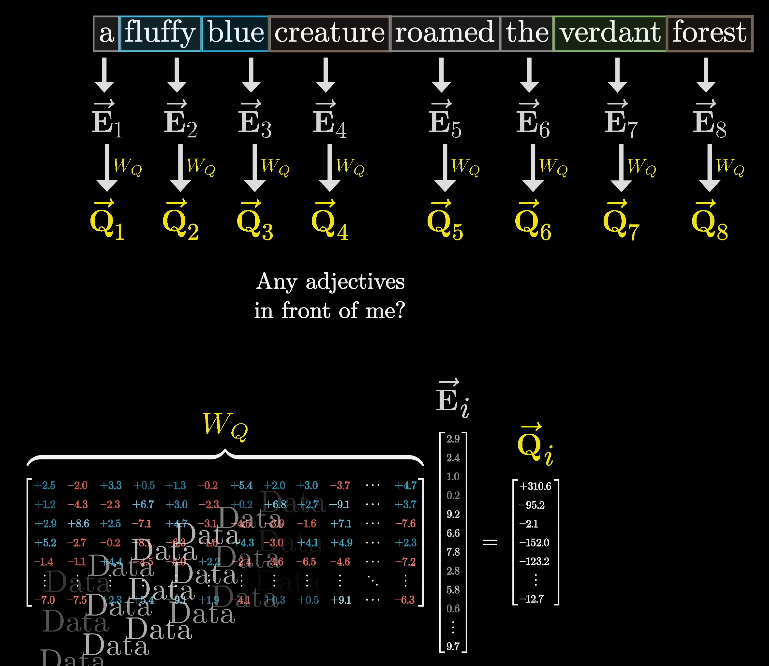

Notes:

In this case, you multiply this matrix by all of the embeddings in the context,  
producing one query vector for each token. The entries of this matrix are parameters of the model,  which means the true behavior is learned from data, and in practice,  
what this matrix does in a particular attention head is challenging to parse.

--

## Key Matrix

<!-- .slide: class="align-center" -->

Notes:

At the same time, associated with this is a second matrix called the key matrix,  
which you also multiply by every one of the embeddings.  
This produces a second sequence of vectors that we call the keys.  
Conceptually, you want to think of the keys as potentially answering the queries.

--

## Key Alignment

<!-- .slide: class="align-center" -->

Notes:

This key matrix is also full of tunable parameters, and just like the query matrix,  
it maps the embedding vectors to that same smaller dimensional space.  
You think of the keys as matching the queries whenever they closely align with each other.

--

## Dot Product 

<!-- .slide: class="align-center" -->

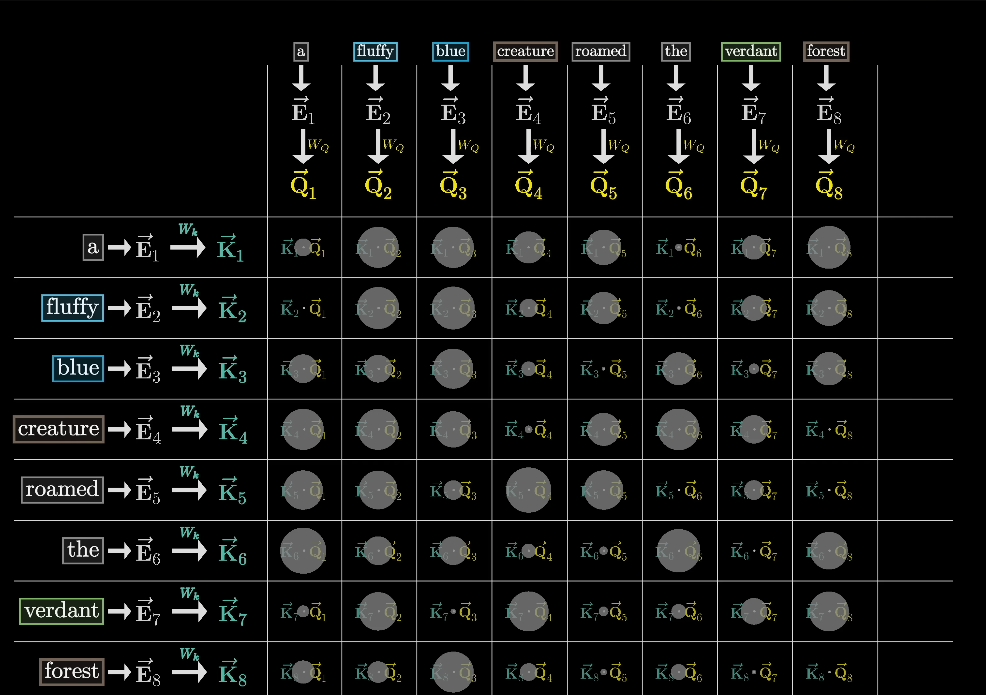

Notes:

To measure how well each key matches each query,  
you compute a dot product between each possible key-query pair.

--

## Adjective Alignment

<!-- .slide: class="align-center" -->

Notes:

In our example, you would imagine that the key matrix maps the adjectives like fluffy and  
blue to vectors that are closely aligned with the query produced by the word creature.

--

## Compact Notation

<!-- .slide: class="align-center" -->

Notes:

Now if you look at the original transformer paper, 
there's a really compact way that they write this all down.
Here the variables q and k represent the full arrays of query 
and key vectors respectively, those little vectors you get by 
multiplying the embeddings by the query and the key matrices.

--

## Softmax Application

<!-- .slide: class="align-center" -->

Notes:

Then this softmax that's wrapped around the full expression 
is meant to be understood to apply column by column.

--

## Simultaneus Prediction

<!-- .slide: class="align-center" -->

Notes:

During the training process, when you run this model on a given text example, 
and all of the weights are slightly adjusted and tuned to either reward or punish it 
based on how high a probability it assigns to the true next word in the passage, 
it turns out to make the whole training process a lot more efficient if you 
simultaneously have it predict every possible next token following each initial 
subsequence of tokens in this passage.
For example, with the phrase that we've been focusing on, 
it might also be predicting what words follow creature and what words follow the.
This is really nice, because it means what would otherwise 
be a single training example effectively acts as many.

--

## Causal Masking

<!-- .slide: class="align-center" -->

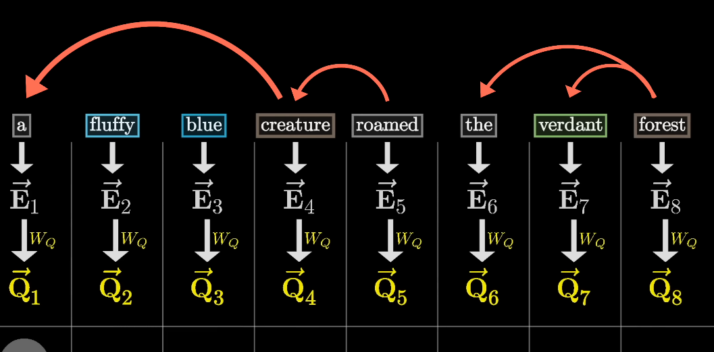

Notes:

For the purposes of our attention pattern, it means that you never 
want to allow later words to influence earlier words, 
since otherwise they could kind of give away the answer for what comes next.

--

## Masking Details

<!-- .slide: class="align-center" -->

Notes:

What this means is that we want all of these spots here, 
the ones representing later tokens influencing earlier ones, 
to somehow be forced to be zero.

--

## Masking Process

<!-- .slide: class="align-center" -->

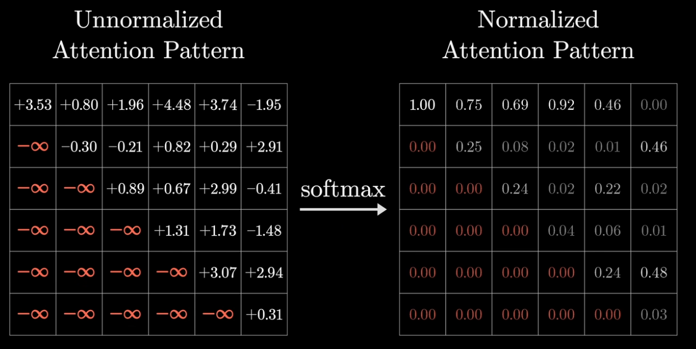

Notes:

So instead, a common way to do this is that before applying softmax, 
you set all of those entries to be negative infinity.
If you do that, then after applying softmax, all of those get turned into zero, 
but the columns stay normalized.
This process is called masking.

--

## Attention Update

<!-- .slide: class="align-center" -->

Notes:

Okay, great, computing this pattern lets the model 
deduce which words are relevant to which other words.
Now you need to actually update the embeddings, 
allowing words to pass information to whichever other words they're relevant to.

--

## Embedding Shift

<!-- .slide: class="align-center" -->

Notes:

or example, you want the embedding of Fluffy to somehow cause a change 
to Creature that moves it to a different part of this 12,000-dimensional 
embedding space that more specifically encodes a Fluffy creature.

--

## Value Vectors

<!-- .slide: class="align-center" -->

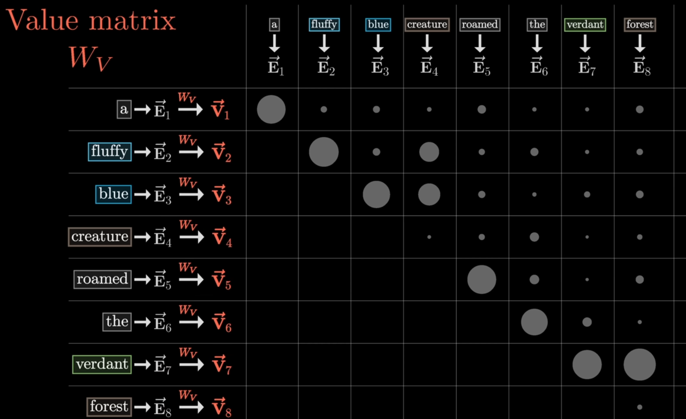

Notes:

Looking back in our diagram, let's set aside all of the keys and the queries, 
since after you compute the attention pattern you're done with those, 
then you're going to take this value matrix and multiply it by every 
one of those embeddings to produce a sequence of value vectors.

--

## Value Aggregation

<!-- .slide: class="align-center" -->

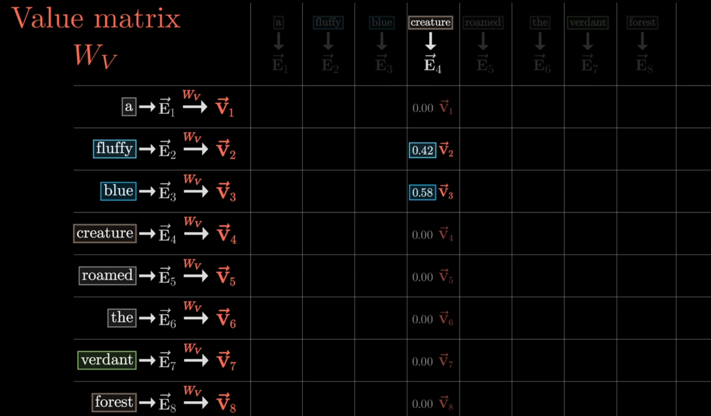

Notes:

For example here, under the embedding of Creature, 
you would be adding large proportions of the value vectors for Fluffy and Blue, 
while all of the other value vectors get zeroed out, or at least nearly zeroed out

--

## Delta Update

<!-- .slide: class="align-center" -->

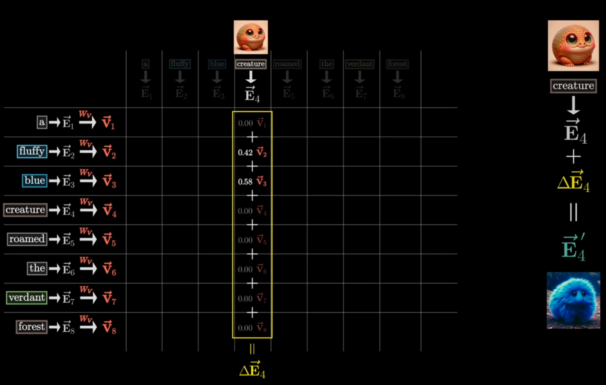

Notes:

nd then finally, the way to actually update the embedding associated with this column, 
previously encoding some context-free meaning of Creature, 
you add together all of these rescaled values in the column, 
producing a change that you want to add, that I'll label delta-e, 
and then you add that to the original embedding.
Hopefully what results is a more refined vector encoding the more 
contextually rich meaning, like that of a fluffy blue creature.

--

## Attention Head

<!-- .slide: class="align-center" -->

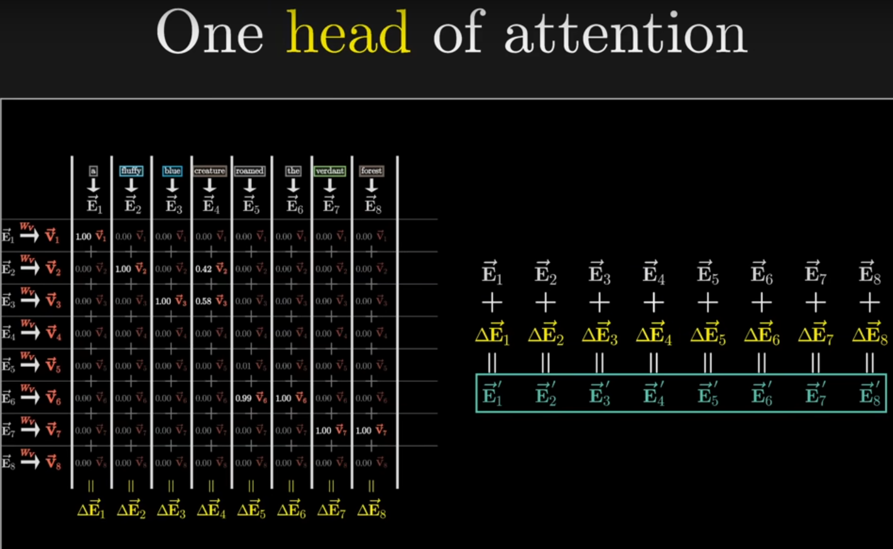

Notes:

Zooming out, this whole process is what you would describe as a single head of attention.

--

## Multi-head Attention

<!-- .slide: class="align-center" -->

Notes:

GPT-3 for example uses 96 attention heads inside each block.
Considering that each one is already a bit confusing, 
it's certainly a lot to hold in your head.
Just to spell it all out very explicitly, this means you have 96 
distinct key and query matrices producing 96 distinct attention patterns.
Then each head has its own distinct value matrices 
used to produce 96 sequences of value vectors.

--

## Parallel Processing

<!-- .slide: class="align-center" -->

Notes:

The overall idea is that by running many distinct heads in parallel, 
you're giving the model the capacity to learn many distinct ways that context 
changes meaning.

--

## Questions Time

--

## Domanda 1:  
Quale problema è tipico degli embedding iniziali ottenuti da una lookup table nei modelli transformer?

**A**) Essi assegnano significati contestuali univoci a ciascun token  
**B**) Essi forniscono lo stesso embedding per un token indipendentemente dal contesto  
**C**) Essi incorporano già tutte le informazioni semantiche  
**D**) Essi aggiornano dinamicamente il significato dei token  

Notes:  
B

--

## Domanda 2:  
Come può il modello differenziare i molteplici significati di una parola polisemica?

**A**) Utilizzando embedding fissi che non variano con il contesto  
**B**) Aggiornando gli embedding in base al contesto per orientarsi verso direzioni semantiche specifiche  
**C**) Eliminando i significati meno frequenti durante la fase di pre-allenamento  
**D**) Assegnando un significato casuale ad ogni occorrenza  

Notes:  
B

--

## Domanda 3:  
In presenza di parole modificatrici, come viene aggiornato l'embedding di un termine?

**A**) Rimane invariato perché il contesto non influenza l'embedding  
**B**) Viene modificato per riflettere una specifica interpretazione in base alle parole circostanti  
**C**) Viene sostituito da un embedding medio di tutti i termini nel contesto  
**D**) Viene cancellato e ricreato da zero  

Notes:  
B

--

## Domanda 4:  
Quale operazione consente di misurare la similarità tra la "domanda" (query) e la "chiave" (key) nel meccanismo di attenzione?

**A**) La somma degli elementi dei vettori  
**B**) Il calcolo del dot product tra il vettore query e il vettore key  
**C**) La sottrazione dei vettori  
**D**) La concatenazione dei vettori  

Notes:  
B

--

## Domanda 5:  
Qual è lo scopo principale dell'applicazione del masking nel meccanismo di attenzione?

**A**) Consentire ai token futuri di influenzare quelli passati  
**B**) Impedire che informazioni da token successivi alterino il contesto dei token precedenti  
**C**) Migliorare la velocità di calcolo delle operazioni matriciali  
**D**) Normalizzare automaticamente gli embedding  

Notes:  
B

