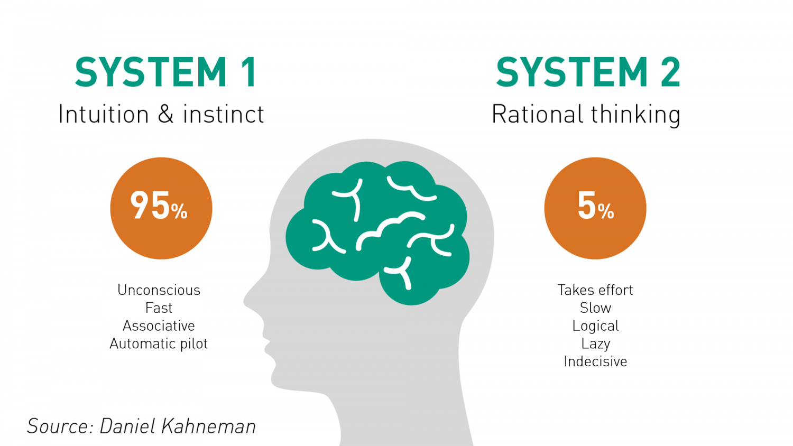

#  Large Language Models: The Digital Grimoires of the 21st Century

Ing. Flavio Cordari

--

## Agenda

--

## Large Language Models

Large Language Models (LLMs) represent a significant leap in artificial intelligence and natural language processing capabilities. Their ability to understand, generate, and interact using human-like language has opened up new possibilities in AI, from creating more intuitive user interfaces to generating content and even coding.

--

## Algorithms and Applications Classification

<!-- .slide: class="align-center" -->

    
    
    
    

--

## Algorithms and Applications Examples

<!-- .slide: class="align-center" -->

    
    
    
    
    
    

--

<!-- .slide: class="align-center" -->

## LLMs combine NLP and DL methods 

--

<!-- .slide: class="align-center" -->

## The Imitation Game

<!-- { "pdf": "assets/lix-236-433.pdf" } -->

Notes:
The Turing Test was designed to assess a machine’s ability to exhibit intelligent verbal behavior comparable to that of a human. Turing proposed that a human evaluator would engage in natural language conversations with both a human and a machine, and if the evaluator could not distinguish between them, the machine would demonstrate its capacity for faithfully imitating human verbal behavior. 

--

> ChatGPT-4 exhibits behavioral and personality traits that are statistically indistinguishable from a random human from tens of thousands of human subjects from more than 50 countries.

[Article](https://www.pnas.org/doi/10.1073/pnas.2313925121)

--

<!-- .slide: class="align-center" -->
## Characteristica Universalis

Notes:
Gottfried Wilhelm Leibniz (1646–1716) was a German polymath and philosopher who made significant contributions across a wide range of academic fields, including mathematics
This concept envisioned a universal language or symbolism that could represent all human knowledge in a formal, logical system. Leibniz imagined this as a means to encode ideas, arguments, and principles in a way that they could be analyzed and manipulated logically. The ultimate goal was to reduce reasoning to a form of computation, where arguments could be solved with the same certainty as mathematical equations. 

--

<!-- .slide: class="align-center" -->

> The history of the modern computing machine goes back to Leibniz and Pascal. Indeed, the general idea of a computing machine is nothing but a mechanization of Leibniz's calculus ratiocinator.

— Wiener (1948, p. 214)

--

A LLM can be seen as a realization of Leibniz's vision in several ways
- It processes natural language (a form of universal language) to understand, generate, and manipulate information. 
- Though not precisely what Leibniz envisioned as a purely symbolic system, natural language processing (NLP) technologies achieve a similar end: encoding and reasoning about human knowledge. 

--

## Compression is Comprehension

--

Notes:
In information theory, compression is about representing information in a way that reduces redundancy without losing the essence of the original data. This is done through various algorithms that identify patterns and represent them more efficiently.

--

Notes:
In the context of cognitive science, our brains understand and learn about the world by compressing sensory inputs and experiences into models, schemas, or concepts that are simpler than the sum total of possible data. This process allows us to make sense of complex environments and predict future events based on past experiences.

--

As early as 1969, neuroscientist Horace Barlow wrote that the operations involved in the compression of information:

> “… have a rather fascinating similarity to the task of answering an intelligence test, finding an appropriate scientific concept, or other exercises in the use of inductive reasoning. Thus, compression of information may lead one towards understanding something about the organization of memory and intelligence, as well as pattern recognition and discrimination.”

--

LLMs training involve a lossy compression of textual datasets but, despite this, can still generate text.

--

## What about consciousness?

--

<!-- .slide: class="align-center" -->

[Full Article](https://www.nytimes.com/2022/07/23/technology/google-engineer-artificial-intelligence.html)

Notes:
There are reported examples of individuals who believe that ChatGPT is conscious. As reported by The New York Times on 23 July 2022 (accessed on 23 July 2022), Google fired engineer Blake Lemoine for claiming that Google’s Language Model for Dialogue Applications (LaMDA) was sentient, (i.e., experiencing sensations, perceptions, and other subjective experiences). 

--

## Human Cognition

<!-- .slide: class="align-center" -->

Notes:
According to Daniel Kahneman, humans possess two complementary cognitive systems: “System 1”, which involves rapid, intuitive, automatic, and non-conscious information processing; and “System 2”, which encompasses slower, reflective, conscious reasoning and decision-making 

--

The fast neural network computation performed by LLMs, resulting in convincing dialogues, aligns with the fast thinking associated with “System 1”. 

According to Kahneman’s description, being on the “System 1” level means that LLMs lack consciousness, which, in this context, is characteristic of “System 2”.

--

## Why Grimoires? 

<!-- .slide: class="align-center" -->

Notes:
The analogy here is that just as grimoires were the repositories of arcane knowledge and power in their time, LLMs are the contemporary digital equivalents, holding vast amounts of human knowledge. However, instead of spells and magical rites, LLMs contain the collective textual data of humanity, capable of generating insights, answers, and even creating new content based on this data.

