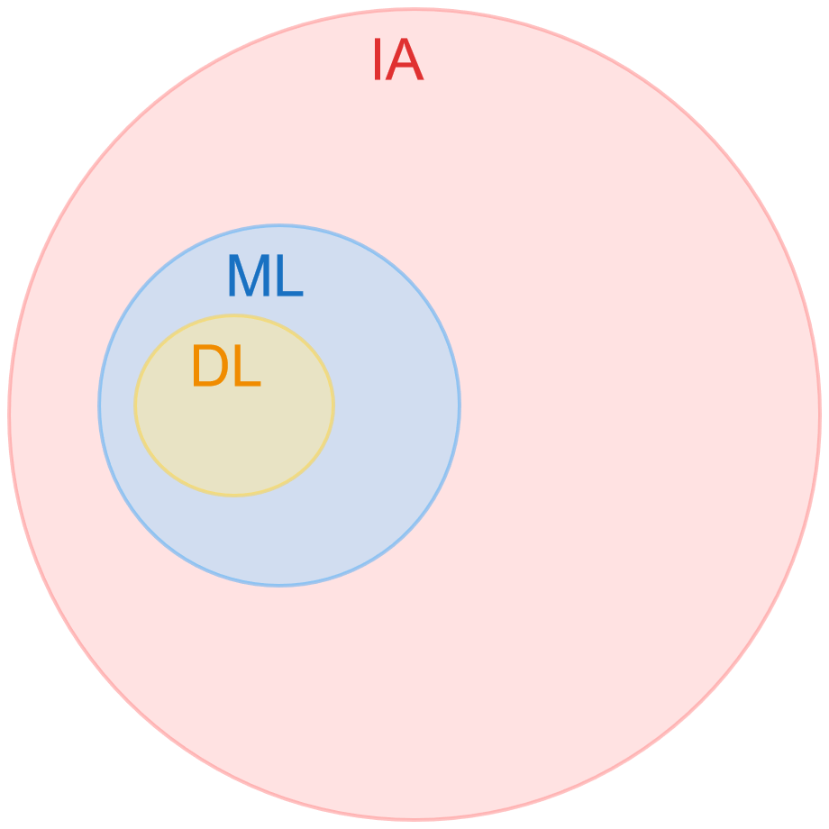
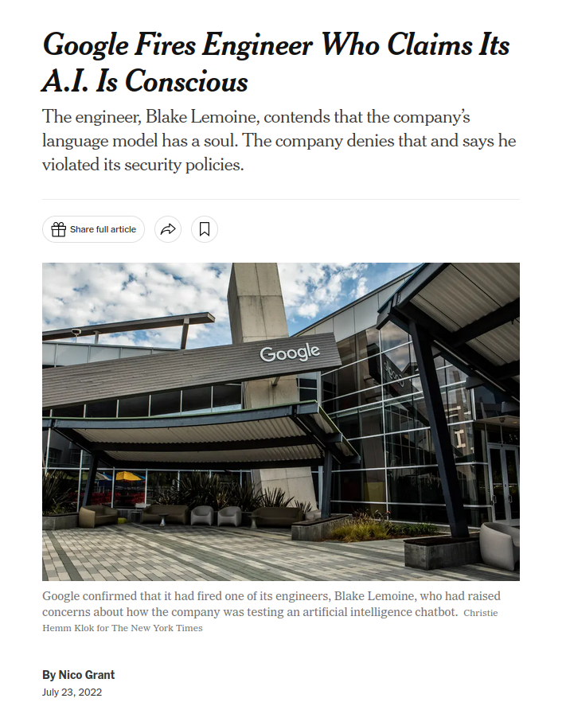

#  Large Language Models: The Digital Grimoires of the 21st Century

--

## Who am I?

<!-- .slide: class="align-center" -->

<!-- { "pdf": "assets/CV_Flavio.pdf" } -->

--

## Workshop's Agenda

--

## Today's Agenda

- Introduction <!-- .element: class="fragment fade-in-then-semi-out" -->
- Deep Learning  <!-- .element: class="fragment fade-in-then-semi-out" -->
- Natural Language Processing  <!-- .element: class="fragment fade-in-then-semi-out" -->
- Large Language Models  <!-- .element: class="fragment fade-in-then-semi-out" -->
- Extras  <!-- .element: class="fragment fade-in-then-semi-out" -->

---

# Introduction

--

## Definition

A **Large Language Model** (LLM) is a *type of artificial intelligence (AI) algorithm* that uses deep learning (DL) and natural language processing (NLP) techniques over massively large data sets to understand, summarize, generate and predict new textual content.

--

<!-- .slide: class="align-center" -->
## Classification

    
    
    
    
    

Notes:
The space contains all the possible algorithms; some of them are related to AI. Among AI's algorithms we have machine learning algorithms; a subset of them uses Deep Learning techniques. In the landscape of AI's algorithms there are algorithm's which process natural language; because these can also use Deep Learning techniques, both sets overlaps.

--

<!-- .slide: class="align-center" -->

## Characteristica Universalis

Notes:
Gottfried Wilhelm Leibniz (1646–1716) was a German mathematician and philosopher who made significant contributions across a wide range of academic fields

Characteristica Universalis concept envisioned a universal language or symbolism that could represent all human knowledge in a formal, logical system. Leibniz imagined this as a means to encode ideas, arguments, and principles in a way that they could be analyzed and manipulated logically. The ultimate goal was to reduce reasoning to a form of computation, where arguments could be solved with the same certainty as mathematical equations. 

A LLM can be seen as a realization of Leibniz's vision in several ways
- It processes natural language (a form of universal language) to understand, generate, and manipulate information. 
- Though not precisely what Leibniz envisioned as a purely symbolic system, natural language processing (NLP) technologies achieve a similar end: encoding and reasoning about human knowledge. 

--

<!-- .slide: class="align-center" -->

## The Imitation Game

<!-- { "pdf": "assets/lix-236-433.pdf" } -->

Notes:
Alan  Turing was an English mathematician, computer scientist, logician, cryptanalyst, philosopher and theoretical biologist.Turing was highly influential in the development of theoretical computer science, providing a formalisation of the concepts of algorithm and computation with the Turing machine, which can be considered a model of a general-purpose computer. He is widely considered to be the father of theoretical computer science and artificial intelligence.

The Turing Test was designed to assess a machine’s ability to exhibit intelligent verbal behavior comparable to that of a human. Turing proposed that a human evaluator would engage in natural language conversations with both a human and a machine, and if the evaluator could not distinguish between them, the machine would demonstrate its capacity for faithfully imitating human verbal behavior. 

--

> ChatGPT-4 exhibits behavioral and personality traits that are statistically indistinguishable from a random human from tens of thousands of human subjects from more than 50 countries.

<small style="float:right; font-size:xx-small">[A Turing test of whether AI chatbots are behaviorally similar to humans](https://www.pnas.org/doi/10.1073/pnas.2313925121)</small>

--

<!-- .slide: class="align-center" -->

## Beyond the Imitation Game

<!-- { "pdf": "assets/2206.04615.pdf" } -->

Notes:
p. 2 
BIG-bench currently consists of 204 tasks, contributed by 450 authors across 132
institutions. Task topics are diverse, drawing problems from linguistics, childhood develop-
ment, math, common-sense reasoning, biology, physics, social bias, software development,
and beyond. **BIG-bench focuses on tasks that are believed to be beyond the capabilities
of current language models**

--

## Emergent Abilities

> An ability is emergent if it is not present in smaller models but is present in larger models.

<small style="float:right; font-size:xx-small"><a href="https://arxiv.org/abs/2206.07682">Emergent Abilities of Large Language Models</a></small>

--

<!-- .slide: class="align-center" -->

<small style="float:right; font-size:xx-small"><a href="https://arxiv.org/abs/2206.07682">Emergent Abilities of Large Language Models</a></small>

Notes:
- On most tasks, performance improved predictably and smoothly as the models scaled up — the larger the model, the better it got. But **with other tasks, the jump in ability wasn’t smooth**. The performance remained near zero for a while, then performance jumped. Other studies found similar leaps in ability. 
- Researchers noted that **these behaviors are not only surprising but unpredictable**, and that they should inform the **evolving conversations around AI safety, potential and risk**. They called the abilities “emergent,” a word that describes collective behaviors that only appear once a system reaches a high level of complexity.

--

> Strong claims of emergence have as much to do with the way we choose to measure as they do with what the models are doing.

<small style="float:right; font-size:xx-small"><a href="https://arxiv.org/abs/2304.15004">Are Emergent Abilities of Large Language Models a Mirage?</a></small>

Notes: 
No one is disputing that large enough LLMs can complete tasks that smaller models can’t, including ones for which they weren’t trained.  LLMs become more effective as they scale up; in fact, the added complexity of larger models should make it possible to get better at more difficult and diverse problems. Whether this improvement looks smooth and predictable or jagged and sharp **results from the choice of metric — or even a paucity of test examples — rather than the model’s inner workings**.

--

<!-- .slide: class="align-center" -->

<small style="font-size:xx-small;"> [How Quickly Do Large Language Models Learn Unexpected Skills?](https://www.quantamagazine.org/how-quickly-do-large-language-models-learn-unexpected-skills-20240213/) </small>

Notes:
**Three-digit addition offers an example**. In the 2022 BIG-bench study, researchers reported that with fewer parameters, both GPT-3 and another LLM named LAMDA failed to accurately complete addition problems. However, when GPT-3 trained using 13 billion parameters, its ability changed as if with the flip of a switch. Suddenly, it could add — and LAMDA could, too, at 68 billion parameters. This suggests that the ability to add emerges at a certain threshold.

But the Stanford researchers point out that the LLMs were judged only on accuracy: Either they could do it perfectly, or they couldn’t. So even if an LLM predicted most of the digits correctly, it failed. That didn’t seem right. **If you’re calculating 100 plus 278, then 376 seems like a much more accurate answer than, say, −9.34.**

So instead, Koyejo and his collaborators tested the same task using a metric that awards partial credit. “We can ask: **How well does it predict the first digit? Then the second? Then the third?**” he said.

--

## What about consciousness?

--

<!-- .slide: class="align-center" -->

<small style="font-size:xx-small;">  [Google Fires Engineer Who Claims Its A.I. Is Conscious](https://www.nytimes.com/2022/07/23/technology/google-engineer-artificial-intelligence.html) </small> 

Notes:
There are reported examples of individuals who believe that ChatGPT is conscious. As reported by The New York Times on 23 July 2022 (accessed on 23 July 2022), Google fired engineer Blake Lemoine for claiming that Google’s Language Model for Dialogue Applications (LaMDA) was sentient, (i.e., experiencing sensations, perceptions, and other subjective experiences). 

--

## LLMs vs Humans

<!-- .slide: class="align-center" -->

<small style="font-size:xx-small; ">  [Thing 1 and Thing 2 ](https://www.rogerleishman.com/2017/12/thing1.html) </small> 

Notes:
To make a connection to human abilities, it is helpful to examine Large Language Models (LLMs) not only in terms of their implemented mechanisms of data/information processes and architectures but also in comparison to human cognition.

According to Daniel Kahneman, humans possess two complementary cognitive systems: “System 1”, which involves rapid, intuitive, automatic, and non-conscious information processing (95% of brain activity); and “System 2”, which encompasses slower, reflective, conscious reasoning and decision-making (5% of brain activity)

**The fast neural network computation performed by LLMs, resulting in convincing dialogues, aligns with the fast thinking associated with “System 1”**. 

According to Kahneman’s description, **being on the “System 1” level means that LLMs lack consciousness**, which, in this context, is characteristic of “System 2”.

--

## Compression is Comprehension

> A model is thus better if it can explain **more** with *less*

<small style="font-size:xx-small; float:right">  [Compression is Comprehension: The Unreasonable Effectiveness of Digital Computation in the Natural World](https://arxiv.org/pdf/1904.10258v3.pdf) </small> 

Notes:
In information theory, compression is about representing information in a way that reduces redundancy without losing the essence of the original data. This is done through various **algorithms that identify patterns** and represent them more efficiently.

In the context of cognitive science, our brains understand and learn about the world by **compressing sensory inputs and experiences into models, schemas, or concepts that are simpler than the sum total of possible data**. This process allows us to make sense of complex environments and predict future events based on past experiences

**LLMs training involve a process of lossy compression of very large textual datasets but, despite this, can still generate text.**

--

## Why Grimoires? 

<!-- .slide: class="align-center" -->

Notes:
The analogy here is that just as grimoires were the repositories of arcane knowledge and power in their time, LLMs are the contemporary digital equivalents, holding vast amounts of human knowledge. However, instead of spells and magical rites, LLMs contain the collective textual data of humanity, capable of generating insights, answers, and even creating new content based on this data.

--