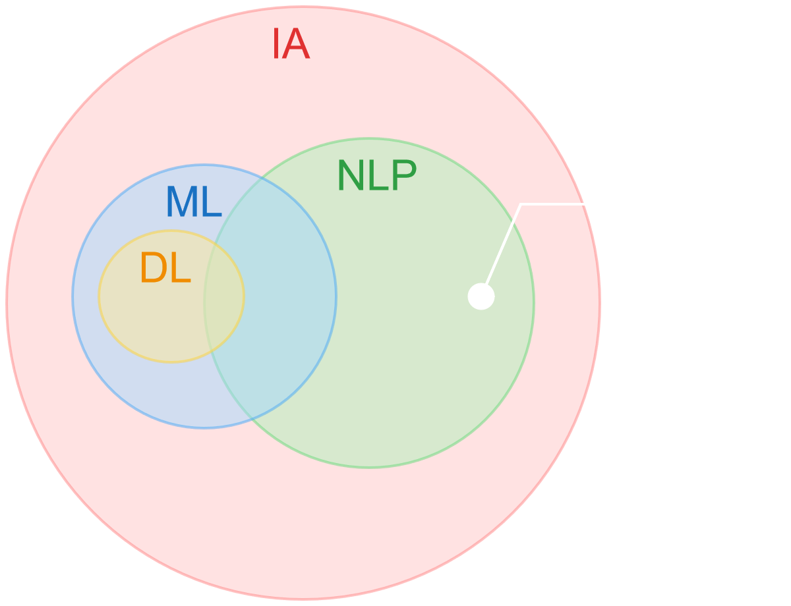
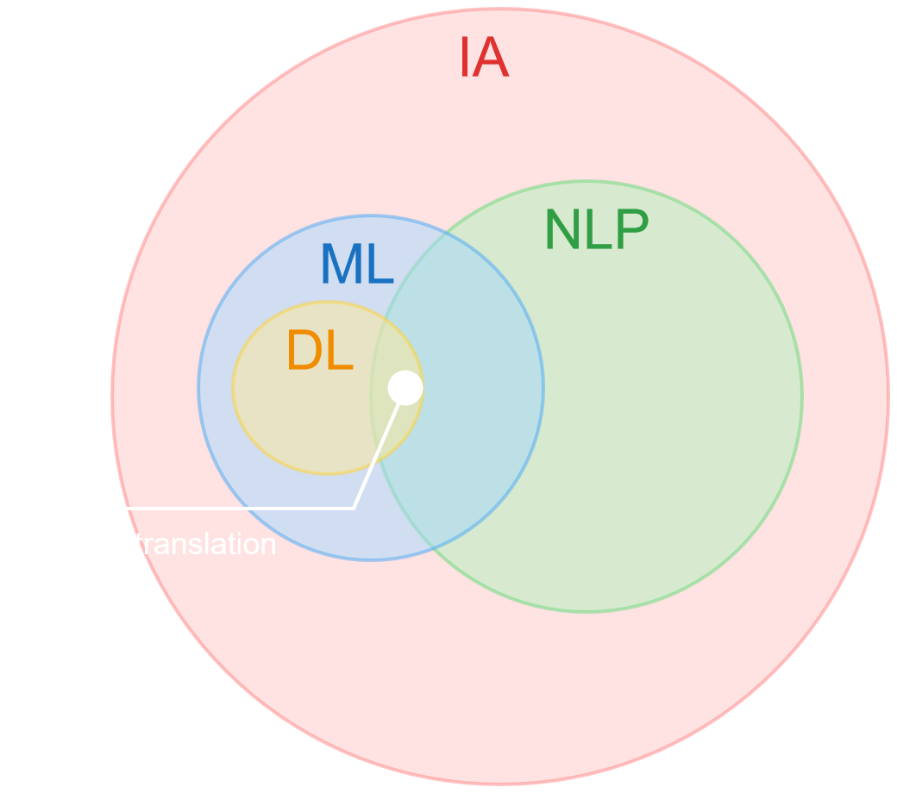

# NLP - Natural Language Processing

--


## ELIZA - A rule-based chatbot

```text
 User: I am unhappy.
 ELIZA: DO YOU THINK COMING HERE WILL HELP YOU NOT TO BE UNHAPPY
 User: I need some help, that much seems certain.
 ELIZA: WHAT WOULD IT MEAN TO YOU IF YOU GOT SOME HELP
 User: Perhaps I could learn to get along with my mother.
 ELIZA: TELL ME MORE ABOUT YOUR FAMILY
 User: My mother takes care of me.
 ELIZA: WHO ELSE IN YOU FAMILY TAKES CARE OF YOU
 User: My father.
 ELIZA: YOUR FATHER
 User: You are like my father in some ways.
```

<small style="font-size:xx-small; float:right">Weizenbaum, J. 1966. ELIZA – A computer program for the study of natural language communication between man and machine. CACM, 9(1):36–45.</small>

Notes:
The dialogue above is from ELIZA, an early natural language processing system ELIZA that could carry on a limited conversation with a user by imitating the responses of a Rogerian psychotherapist (Weizenbaum, 1966). ELIZA is a surprisingly simple program that uses pattern matching to recognize phrases like “I need X” and translate them into suitable outputs like “What would it mean to you if you got X?”. This simple technique succeeds in this domain because ELIZA doesn’t actually need to know anything to mimic a Rogerian psychotherapist. As Weizenbaum notes, this is one of the few dialogue genres where listeners can act as if they know nothing of the world. ELIZA’s mimicry of human conversation was remarkably successful: many people who interacted with ELIZA came to believe that it really understood them and their problems, many continued to believe in ELIZA’s abilities even after the program’s operation was explained to them (Weizenbaum, 1976), and even today such chatbots are a fun diversion.

--

ELIZA works by having a series or cascade of regular expression substitutions each of which matches and changes some part of the input line.

```text
s/.* YOU ARE (depressed|sad) .*/I AM SORRY TO HEAR YOU ARE \1/ 
s/.* YOU ARE (depressed|sad) .*/WHY DO YOU THINK YOU ARE \1/ 
s/.* all .*/IN WHAT WAY/ 
s/.* always .*/CAN YOU THINK OF A SPECIFIC EXAMPLE/
```


--

<!-- .slide: class="align-center" -->

## Regular Expressions


Notes:
We’ll begin with the most important tool for describing text patterns: the regular expression. Regular expressions can be used to specify strings we might want to extract from a document, from transforming “I need X” in ELIZA above, to defining strings like $199 or $24.99 for extracting tables of prices from a document

Regular expressions are particularly useful for **searching in texts**, when we have a **pattern to search** for and a corpus of texts to search through. A regular expression search function will search through the corpus, returning all texts that match the pattern.

--

<!-- .slide: class="align-center" -->
## Rule-based chatbot - Example




[Example](https://colab.research.google.com/drive/1yph2YtXs-6a08gwf4MymHBVlPEebva_y?usp=sharing)

--

<!-- .slide: class="align-center" -->
## Spam Detection - Example


[Example](https://colab.research.google.com/drive/1eOpj3rkCcfA9rJ9xQJjAhAfghdUCFrui?usp=sharing)

--

<!-- .slide: class="align-center" -->
## Machine Translation - Example




[Example]()

