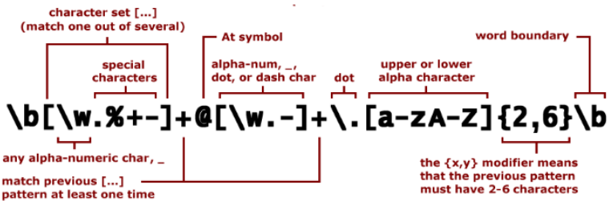
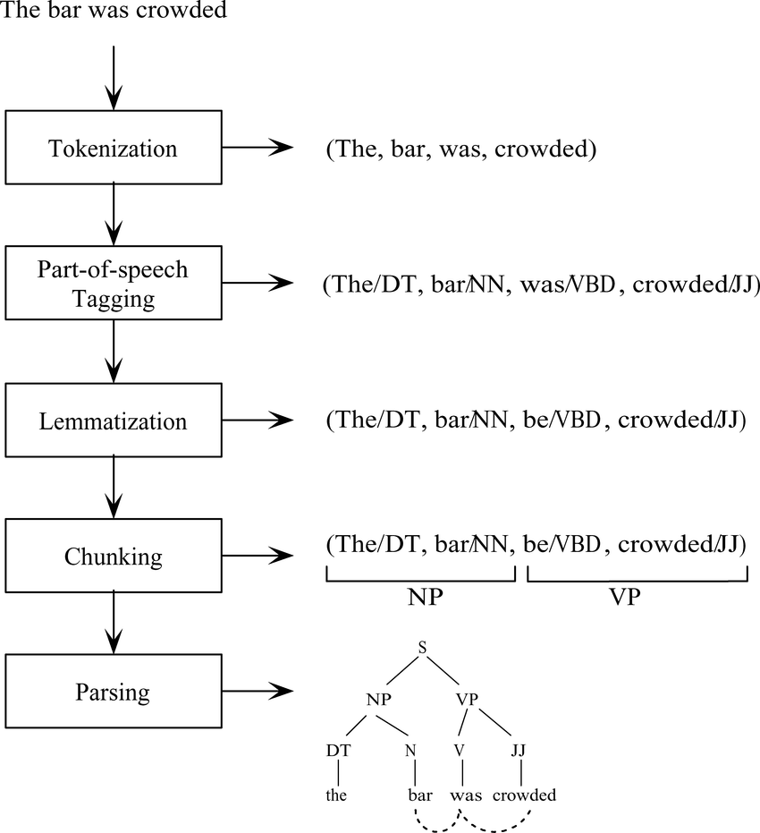

# NLP - Natural Language Processing

--

## Definition

**Natural Language Processing** (NLP) is the field of study that focuses on the **interaction between computers and humans** through the *natural language*.

Notes:
- **Goal**: To enable computers to understand, interpret, and generate human languages in a valuable way.
- **Applications**: Machine translation, sentiment analysis, speech recognition, chatbots, and more.

--

## ELIZA

```text
 User: I am unhappy.
 ELIZA: DO YOU THINK COMING HERE WILL HELP YOU NOT TO BE UNHAPPY
 User: I need some help, that much seems certain.
 ELIZA: WHAT WOULD IT MEAN TO YOU IF YOU GOT SOME HELP
 User: Perhaps I could learn to get along with my mother.
 ELIZA: TELL ME MORE ABOUT YOUR FAMILY
 User: My mother takes care of me.
 ELIZA: WHO ELSE IN YOU FAMILY TAKES CARE OF YOU
 User: My father.
 ELIZA: YOUR FATHER
 User: You are like my father in some ways.
```

<small style="font-size:xx-small; float:right">Weizenbaum, J. 1966. ELIZA – A computer program for the study of natural language communication between man and machine. CACM, 9(1):36–45.</small>

Notes:
The dialogue above is from ELIZA, an **early natural language processing system** ELIZA that could carry on a limited conversation with a user by **imitating the responses of a Rogerian psychotherapist (Weizenbaum, 1966)**. ELIZA is a surprisingly simple program that uses pattern matching to recognize phrases like “I need X” and translate them into suitable outputs like “What would it mean to you if you got X?”. This simple technique succeeds in this domain because ELIZA doesn’t actually need to know anything to mimic a Rogerian psychotherapist. As Weizenbaum notes, this is one of the few dialogue genres where listeners can act as if they know nothing of the world. ELIZA’s mimicry of human conversation was remarkably successful: **many people who interacted with ELIZA came to believe that it really understood them and their problems, many continued to believe in ELIZA’s abilities even after the program’s operation was explained to them (Weizenbaum, 1976)**, and even today such chatbots are a fun diversion.

--

ELIZA works by having a series or **cascade of regular expression substitutions** each of which matches and changes some part of the input line.

```text
s/.* YOU ARE (depressed|sad) .*/I AM SORRY TO HEAR YOU ARE \1/ 
s/.* YOU ARE (depressed|sad) .*/WHY DO YOU THINK YOU ARE \1/ 
s/.* all .*/IN WHAT WAY/ 
s/.* always .*/CAN YOU THINK OF A SPECIFIC EXAMPLE/
```

--

<!-- .slide: class="align-center" -->

## Regular Expressions




Notes:
We’ll begin with the most important tool for describing text patterns: the regular expression. Regular expressions can be used to specify strings we might want to extract from a document, from transforming “I need X” in ELIZA above, to defining strings like $199 or $24.99 for extracting tables of prices from a document

Regular expressions are particularly useful for **searching in texts**, when we have a **pattern to search** for and a corpus of texts to search through. A regular expression search function will search through the corpus, returning all texts that match the pattern.

--

<!-- .slide: class="align-center" -->

## A Rule-based chatbot


[Example](https://colab.research.google.com/drive/1yph2YtXs-6a08gwf4MymHBVlPEebva_y?usp=sharing)

--

# NLP Pipeline

<ol>
   <li class="fragment fade-in-then-semi-out">
      <strong>Data Collection</strong>: Gathering raw text data.
   </li>
   <li class="fragment fade-in-then-semi-out">
      <strong>Text Preprocessing</strong>: Cleaning and preparing text data (Tokenization, stemming, lemmatization, removing stop words, ... )
   </li>
   <li class="fragment fade-in-then-semi-out">
      <strong>Feature Extraction</strong>: Converting text into a format understandable by machine learning algorithms (Bag of Words, TF-IDF, ... )
   </li>
   <li class="fragment fade-in-then-semi-out">
      <strong>Modeling</strong>: Applying algorithms to learn from data.
   </li>
   <li class="fragment fade-in-then-semi-out">
      <strong>Evaluation</strong>: Assessing the performance of the model.
   </li>
   <li class="fragment fade-in-then-semi-out">
      <strong>Deployment</strong>: Integrating the model into applications.
   </li>
</ol>

--

<!-- .slide: class="align-center" -->


# Text Preprocessing



<small style="font-size:xx-small"> [Word Sense Disambiguation: A Survey](https://www.researchgate.net/publication/220566219_Word_Sense_Disambiguation_A_Survey) </small>


Notes:
- **Tokenization**: Splitting text into sentences or words.
- **Stemming**: Reducing words to their base form.
- **Lemmatization**: Similar to stemming, but returns real words.
- **Removing Stop Words**: Eliminating common words that carry less important meaning.
- **Normalization**: Converting all text to a consistent format (e.g., lowercasing).

--

<!-- .slide: class="align-center" -->

# Feature Extraction Techniques

```text
Review 1: This movie is very scary and long
Review 2: This movie is not scary and is slow
Review 3: This movie is spooky and good
```


<small style="font-size:xx-small"> [Quick Introduction to Bag-of-Words (BoW) and TF-IDF for Creating Features from Text](https://www.analyticsvidhya.com/blog/2020/02/quick-introduction-bag-of-words-bow-tf-idf/) </small>

Notes:
- **Bag of Words (BoW)**: Represents text as an unordered collection of words. (first three columns)
- **Term Frequency-Inverse Document Frequency (TF-IDF)**: Reflects the importance of a word to a document in a collection. (other columns)
- **Word Embeddings**: Dense representations of words in a continuous vector space (e.g., Word2Vec, GloVe).

--

## Word Embeddings (1)


Notes:
- Word embeddings are a type of word representation that allows words to be represented as vectors in a continuous vector space.
- Unlike one-hot encoding, embeddings **capture semantic meaning and relationships between words**.
- Improve performance of NLP models.
- Reduce dimensionality compared to sparse representations.

--

## Word Embeddings (2)


Notes:
- Word embeddings are learned from text data.
- The idea is to place words that have similar meanings close together in the vector space.
- Can be trained using models like Word2Vec, GloVe, or FastText.
- Training involves adjusting the vector representations based on word contexts.

--

## Word2Vec


Notes:
- Developed by a team of researchers at Google.
- Utilizes two architectures: Continuous Bag of Words (CBOW) and Skip-Gram.
- **CBOW**: Predicts a word based on context.
- **Skip-Gram**: Predicts context words from a target word.
- Skip-Gram tends to perform well on smaller datasets and with rare words.


