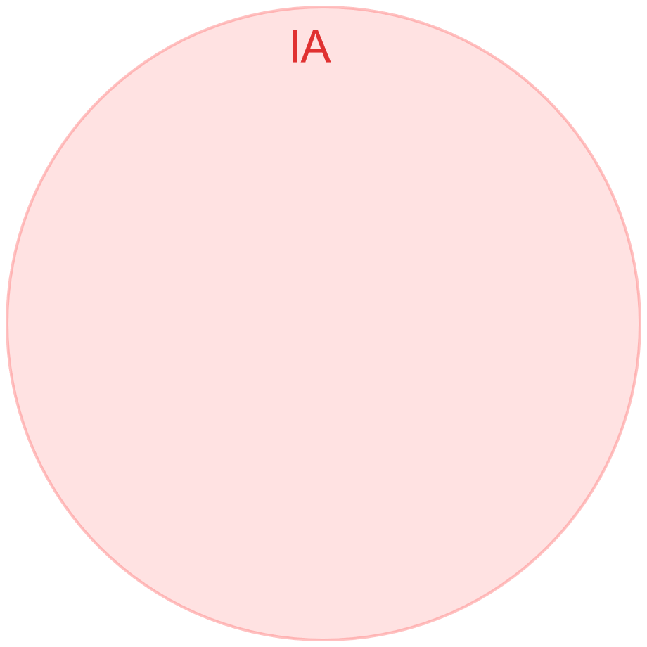

<!-- .slide: data-background="#1A73E8" -->

<iframe src="https://wall.sli.do/event/1uomwHNCDGeXQTsKDah8qz" width="100%" height="600" frameborder="0" scrolling="yes"></iframe>

---

## Natural Language Processing and Machine Learning relationship



testotesto testo testo testotesto testo testotestotesto testo testotestotesto testo testotestotesto testo testotestotesto testo testotestotesto testo testotestotesto testo testotestotesto testo testotestotesto testo testo

Note: 
This will only appear in the speaker notes window.

--

## Natural Language Processing and Machine Learning relationship


Note: 
This will only appear in the speaker notes window.

--


## Artificial Intelligence

is a part of the greater field of Computer Science that __enables computers to solve problems__ previously handled by biological systems. AI has many applications in today's society. NLP and ML are both parts of AI. 
<!-- .element: class="fragment" -->

--

## Natural Language Processing
is a form of AI that gives machines the ability to not just read, but to __understand and interpret human language__. With NLP, machines can make sense of written or spoken text and perform tasks including speech recognition, sentiment analysis, and automatic text summarization.

--

## Machine Learning 
is an application of AI that provides systems the ability to __automatically learn and improve from experience__ without being explicitly programmed. Machine Learning can be used to help solve AI problems and to improve NLP by automating processes and delivering accurate responses.

--

## How Natural Language Processing can be applied

- Translation <!-- .element: class="fragment" -->
- Speech recognition <!-- .element: class="fragment" -->
- Sentiment Analysis <!-- .element: class="fragment" -->
- Chatbots <!-- .element: class="fragment" -->
- Question-Answer Systems <!-- .element: class="fragment" -->
- 

---

## External 3.1

Content 3.1

--

## External 3.2

Content 3.2

--

## External 3.3 (Image)

 <!-- .element: class="r-stretch" -->

--


## The Lorenz Equations

`\[\begin{aligned}
\dot{x}     &= \sigma(y-x) \\
\dot{y}     &= \rho x - y - xz \\
\dot{z}     &= -\beta z + xy
\end{aligned} \]`

---

## echo.c

```c [287: 2|4,6]
/* All of the options in this arg are valid, so handle them. */
p = arg + 1;
do {
    if (*p == 'n')
        nflag = 0;
    if (*p == 'e')
        eflag = '\\';
} while (*++p); 
```
[source](https://git.busybox.net/busybox/tree/coreutils/echo.c?h=1_36_stable#n287)
