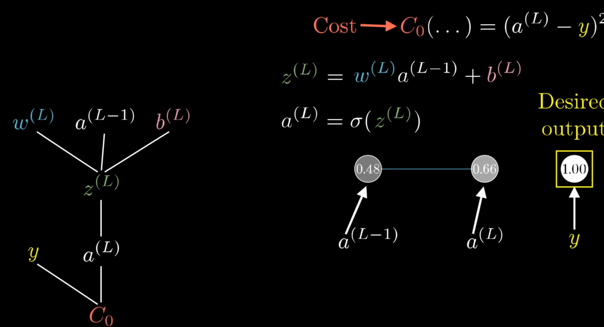
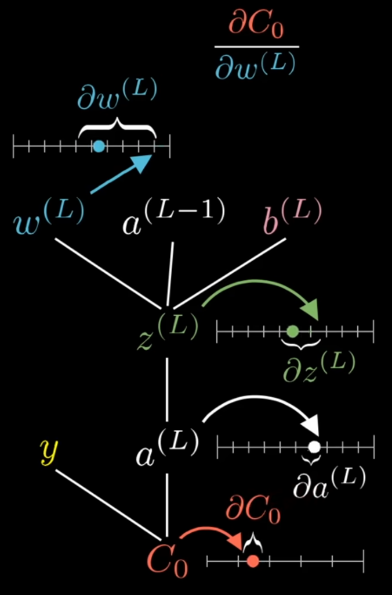
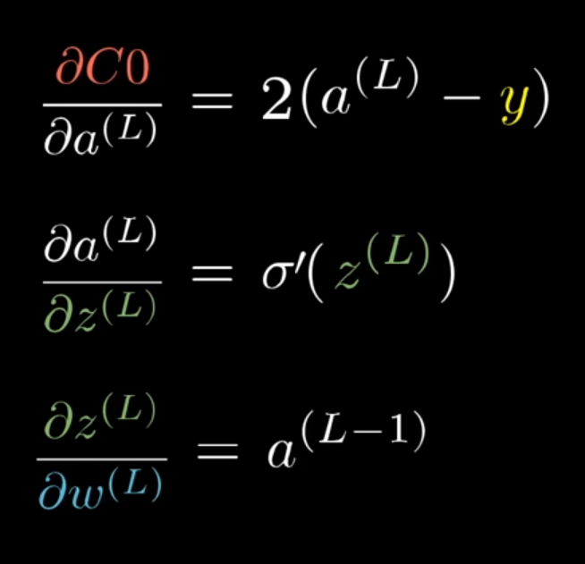
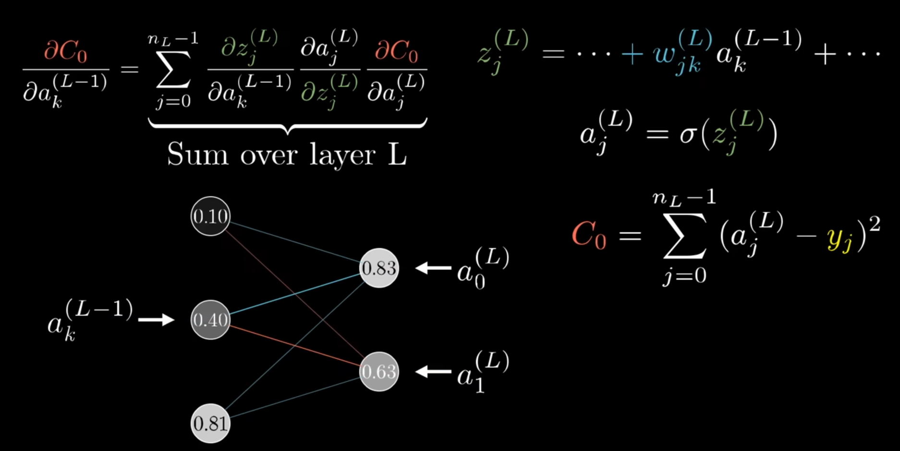

# Backpropagation

<!-- .slide: data-background-image="assets/backprop-title.gif" -->

--

<!-- .slide: class="align-center" -->

## Parameters Update (1)

<video controls muted loop autoplay src="assets/gradient_descent/ezgif-434040be4ae3e3.mp4">

--

## Parameters Update (2)

<!-- .slide: class="align-center" -->

<video controls loop muted autoplay src="assets/backprop/backpropagation-86-102.mov">

--

## Variation Influence

<!-- .slide: class="align-center" -->

<video controls loop muted autoplay src="assets/backprop/backpropagation-135-168.mov">

--

## Expectation Matching

<!-- .slide: class="align-center" -->

<video controls muted src="assets/backprop/backpropagation-236-252.mov">

--

## Tweaking Single Neuron (1) 

<!-- .slide: class="align-center" -->

<video controls muted src="assets/backprop/backpropagation-282-315.mov">

Notes:
- si puo agire sui pesi, sul bias e sull'attivazione dei neuroni dello strato precedente
- 

--

## Tweaking Single Neuron (2) 

<!-- .slide: class="align-center" -->

<video controls autoplay muted src="assets/backprop/backpropagation-409-421.mov">

--

## Tweaking Single Neuron (3) 

<!-- .slide: class="align-center" -->

<video controls autoplay muted src="assets/backprop/backpropagation-421-445-2.mov">

--

## Tweaking Multiple Neurons

<!-- .slide: class="align-center" -->

<video controls muted src="assets/backprop/backpropagation-455-484-2.mov">

--

## Layers Propagation

<!-- .slide: class="align-center" -->

<video controls muted src="assets/backprop/backpropagation-489-509.mov">

--

## Averaged Gradient Estimation

<!-- .slide: class="align-center" -->

<video controls loop muted src="assets/backprop/backpropagation-542-554.mov">

--

## Batching

<!-- .slide: class="align-center" -->

<video controls loop muted src="assets/backprop/backpropagation-593-611.mov">

--

# Backpropagation Calculus

--

## Very Simple Neural Network

<!-- .slide: class="align-center" -->

Notes:

Let's start off with an extremely simple network, one where each layer has a single neuron in it.  This network is determined by three weights and three biases, and our goal is to understand how sensitive the cost function is to these variables.

--

## Neurons Activations

<!-- .slide: class="align-center" -->

Notes:

Let's label the activation of that last neuron with a superscript L, indicating which layer it's in, so the activation of the previous neuron is a(L-1).

--

## Computing Cost Function

<!-- .slide: class="align-center" -->

Notes:

So the cost of this network for a single training example is (a(L) - y) squared.  
We'll denote the cost of that one training example as C0.

--

## Math Symbology

<!-- .slide: class="align-center" -->

Notes:

And then you pump that through some special nonlinear function like the sigmoid or ReLU.  
It's actually going to make things easier for us if we give a special name to this weighted sum, like z, with the same superscript as the relevant activations.

--

## Dependency Tree

<!-- .slide: class="align-center" -->

Notes:

This is a lot of terms, and a way you might conceptualize it is that the weight, previous activation and the bias all together are used to compute z, which in turn lets us compute a, which finally, along with a constant y, lets us compute the cost.

--

## Nudge Effects

<!-- .slide: class="align-center" -->

Notes:

Our first goal is to understand how sensitive the cost function is to small changes in our weight w(L).  
Or phrase differently, what is the derivative of C with respect to w(L)?
What we want is their ratio.  
Conceptually, this tiny nudge to w(L) causes some nudge to z(L), which in turn causes some nudge to a(L), which directly influences the cost.

--

<!-- .slide: class="align-center" -->

Notes:

This right here is the chain rule, where multiplying together these three ratios gives us the sensitivity of C to small changes in w(L).

--

## Derivatives

<!-- .slide: class="align-center" -->

Notes:

The derivative of C with respect to a(L) works out to be 2(a(L)-y).  
Notice this means its size is proportional to the difference between the network's output and the thing we want it to be, so if that output was very different, even slight changes stand to have a big impact on the final cost function.  
The derivative of a(L) with respect to z(L) is just the derivative of our sigmoid function, or whatever nonlinearity you choose to use.  
And the derivative of z(L) with respect to w(L) comes out to be a(L-1).

--

<!-- .slide: class="align-center" -->

Notes:

Since the full cost function involves averaging together all those costs across many different training examples, its derivative requires averaging this expression over all training examples.

--

## Gradient Terms

<!-- .slide: class="align-center" -->

Notes:

And of course, that is just one component of the gradient vector, which itself is built up from the partial derivatives of the cost function with respect to all those weights and biases.

--

## Multiple Neurons Case (1)

<!-- .slide: class="align-center" -->

Notes:

But honestly, not that much changes when we give the layers multiple neurons, really it's just a few more indices to keep track of.  
Rather than the activation of a given layer simply being a(L), it's also going to have a subscript indicating which neuron of that layer it is.  
Let's use the letter k to index the layer L-1, and j to index the layer L.

--

## Multiple Neurons Case (2)

<!-- .slide: class="align-center" -->

Notes:

What does change here, though, is the derivative of the cost with respect to one of the activations in the layer L-1.  
In this case, the difference is that the neuron influences the cost function through multiple different paths.  
That is, on the one hand, it influences a(L)0, which plays a role in the cost function, but it also has an influence on a(L)1, which also plays a role in the cost function, and you have to add those up.
 