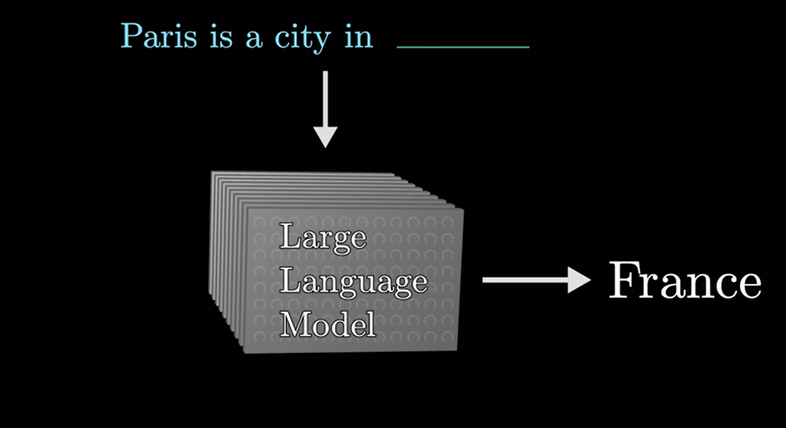
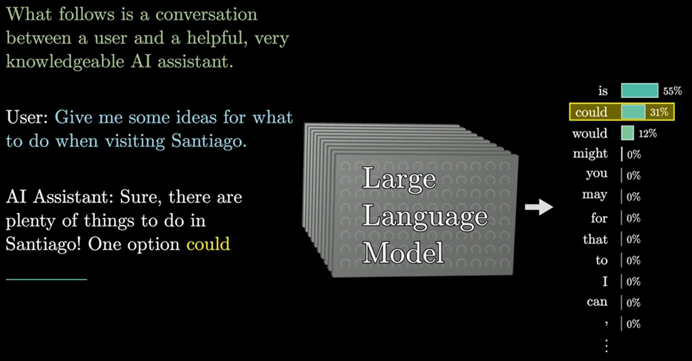
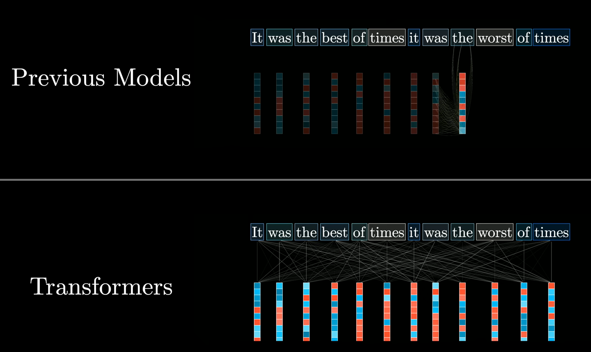
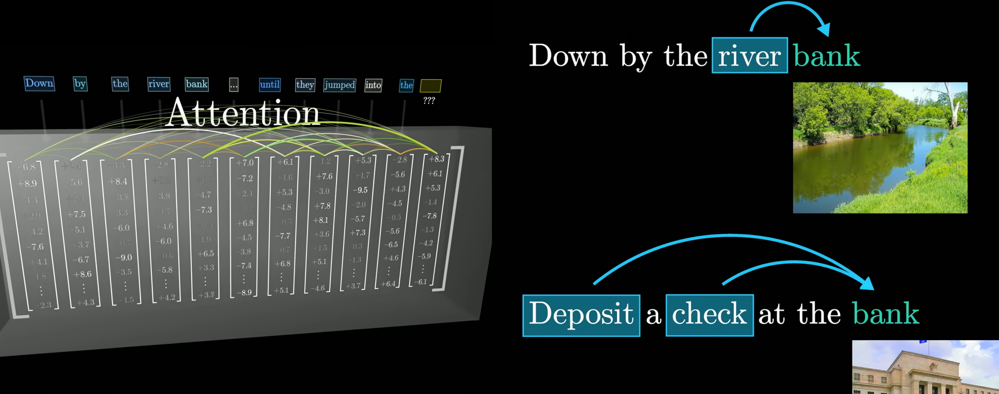
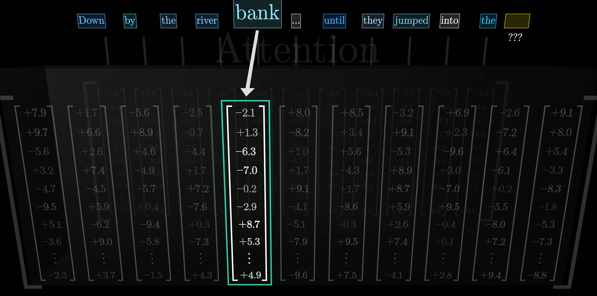

# Large Language Models

--

## What is a LLM (1)

<!-- .slide: class="align-center" -->

Notes:
A large language model is a sophisticated mathematical function  
that predicts what word comes next for any piece of text.

--

## What is a LLM (2)

<!-- .slide: class="align-center" -->

Notes:
Instead of predicting one word with certainty, though,  
what it does is assign a probability to all possible next words. the output tends to look a lot more natural if  you allow it to select less likely words along the way at random.  
So what this means is even though the model itself is deterministic,  
a given prompt typically gives a different answer each time it's run.

--

## Feed

<!-- .slide: class="align-center" -->

Notes:
Models learn how to make these predictions by processing an enormous amount of text,  
typically pulled from the internet.  
For a standard human to read the amount of text that was used to train GPT-3,  for example, if they read non-stop 24-7, it would take over 2600 years.  
Larger models since then train on much, much more.

--

## Tune

<!-- .slide: class="align-center" -->

Notes:
You can think of training a little bit like tuning the dials on a big machine.  
The way that a language model behaves is entirely determined by these  
many different continuous values, usually called parameters or weights.  
Changing those parameters will change the probabilities  
that the model gives for the next word on a given input.

--

## Predict

<!-- .slide: class="align-center" -->

Notes:
An algorithm called backpropagation is used to tweak all of the parameters  
in such a way that it makes the model a little more likely to choose  
the true last word and a little less likely to choose all the others.  
When you do this for many, many trillions of examples,  
not only does the model start to give more accurate predictions on the training data,  
but it also starts to make more reasonable predictions on text that it's never  
seen before.

--

## Hrdware Support

<!-- .slide: class="align-center" -->

Notes:
Looking back at the pre-training, though, this staggering amount of  
computation is only made possible by using special computer chips that  
are optimized for running many operations in parallel, known as GPUs.  
However, not all language models can be easily parallelized.  
Prior to 2017, most language models would process text one word at a time,  
but then a team of researchers at Google introduced a new model known as the transformer.

--

## Transformers (1)

<!-- .slide: class="align-center" -->

Notes:
Transformers don't read text from the start to the finish,  
they soak it all in at once, in parallel.

--

<!-- .slide: class="align-center" -->

## Transformers (2)

--

## Word Embedding

<!-- .slide: class="align-center" -->

Notes:
The very first step inside a transformer, and most other language models for that matter,  
is to associate each word with a long list of numbers.  
The reason for this is that the training process only works with continuous values,  
so you have to somehow encode language using numbers,  
and each of these lists of numbers may somehow encode the meaning of the  
corresponding word.

--

<!-- .slide: class="align-center" -->

## Attention Mechanism (1)

Notes:
What makes transformers unique is their reliance  
on a special operation known as attention.  
This operation gives all of these lists of numbers a chance to talk to one another  
and refine the meanings they encode based on the context around, all done in parallel. 

--

## Attention Mechanism (2)

<!-- .slide: class="align-center" -->

Notes:
For example, the numbers encoding the word bank might be changed based on the  
context surrounding it to somehow encode the more specific notion of a riverbank.

--

## Store and Retrieve Facts

<!-- .slide: class="align-center" -->

Notes:
Transformers typically also include a second type of operation known  
as a feed-forward neural network, and this gives the model extra  
capacity to store more patterns about language learned during training.

--

## Repeat

<!-- .slide: class="align-center" -->

Notes:
All of this data repeatedly flows through many different iterations of  
these two fundamental operations, and as it does so,  
the hope is that each list of numbers is enriched to encode whatever  
information might be needed to make an accurate prediction of what word  
follows in the passage.

--

## Next Word Selection

<!-- .slide: class="align-center" -->

Notes:
At the end, one final function is performed on the last vector in this sequence,  
which now has had a chance to be influenced by all the other context from the input text,  
as well as everything the model learned during training,  
to produce a prediction of the next word.  
Again, the model's prediction looks like a probability for every possible next word.

