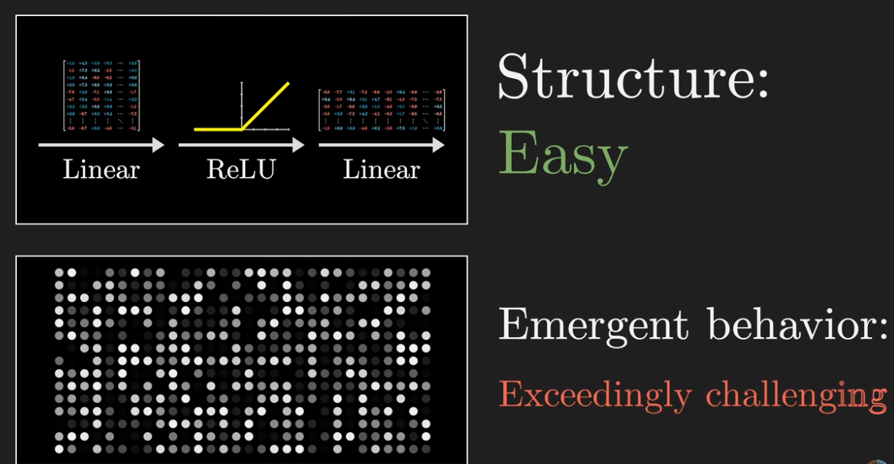
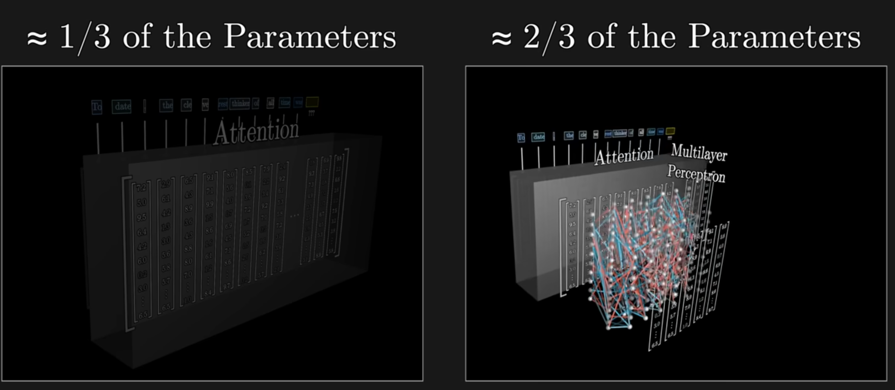
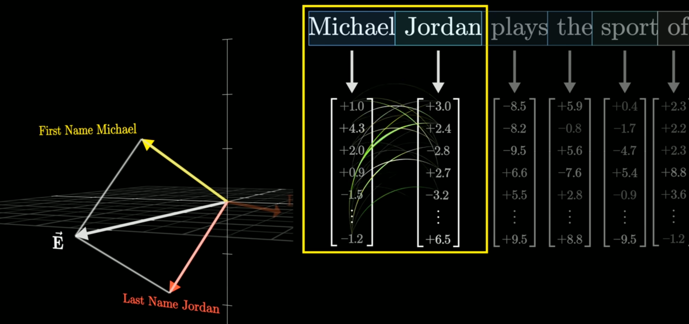
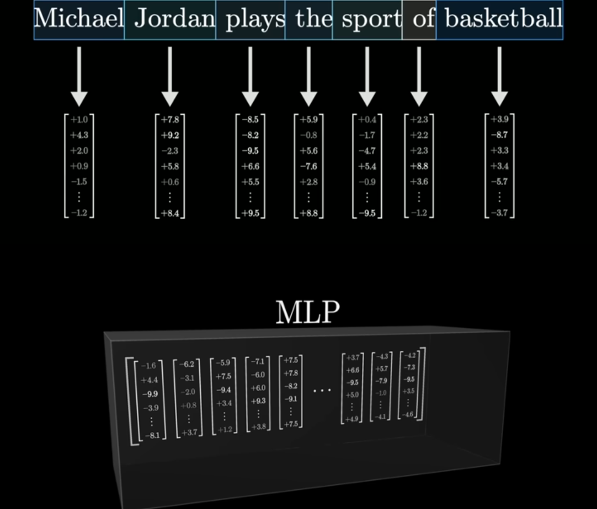
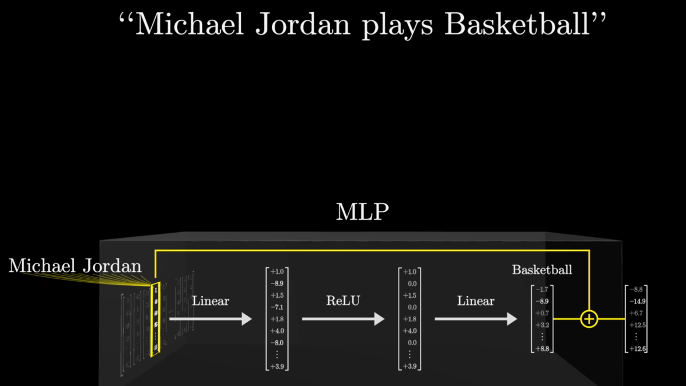
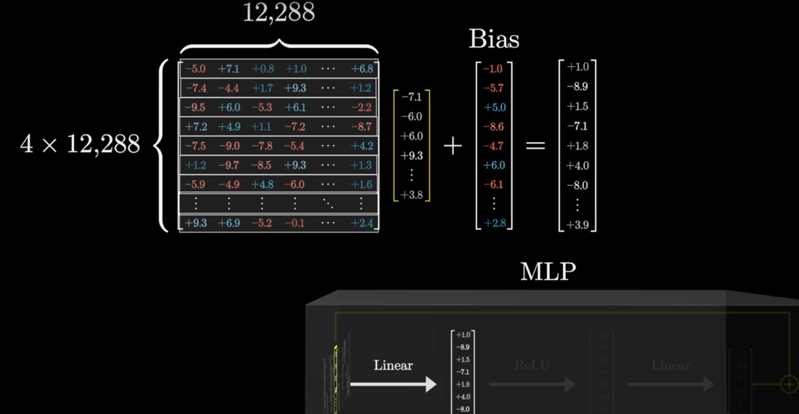
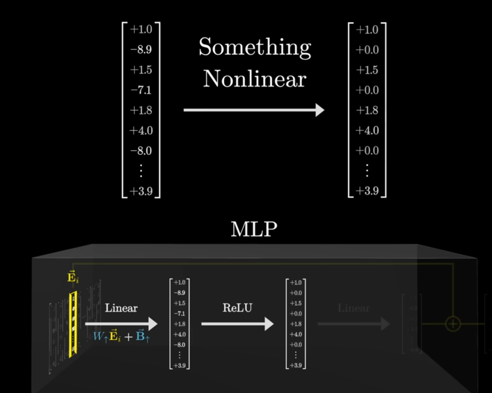
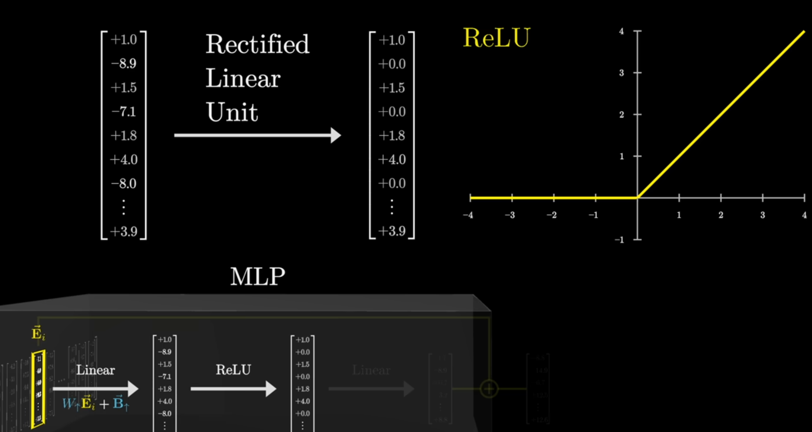
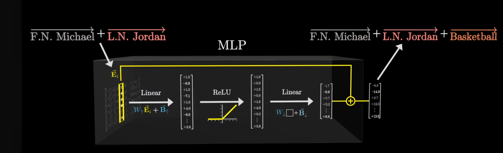

# Multi Layer Perceptron

--

<!-- .slide: class="align-center" -->

--

<!-- .slide: class="align-center" -->

--

<!-- .slide: class="align-center" -->

Notes:

If you feed a large language model the phrase, Michael Jordan plays the sport of blank, and you have it predict what comes next, and it correctly predicts basketball, this would suggest that somewhere, inside its hundreds of billions of parameters, it's baked in knowledge about a specific person and his specific sport. And I think in general, anyone who's played around with one of these models has the clear sense that it's memorized tons and tons of facts.

--

<!-- .slide: class="align-center" -->

Notes:

First, we'll suppose that one of the directions represents the idea of a first name Michael, and then another nearly perpendicular direction represents the idea of the last name Jordan, and then yet a third direction will represent the idea of basketball. So specifically, what I mean by this is if you look in the network and you pluck out one of the vectors being processed, if its dot product with this first name Michael direction is one, that's what it would mean for the vector to be encoding the idea of a person with that first name. Otherwise, that dot product would be zero or negative, meaning the vector doesn't really align with that direction. And for simplicity, let's completely ignore the very reasonable

--

<!-- .slide: class="align-center" -->

Notes:

So let's say a vector is meant to represent the full name, Michael Jordan, then its dot product with both of these directions would have to be one. Since the text Michael Jordan spans two different tokens, this would also mean we have to assume that an earlier attention block has successfully passed information to the second of these two vectors so as to ensure that it can	encode both names.

--

<!-- .slide: class="align-center" -->

Notes:

What happens inside a multilayer perceptron? You might think of this sequence of vectors flowing into the block, and remember, each vector was originally associated with one of the tokens from the input text. What's gonna happen is that each individual vector from that sequence goes through a short series of operations, we'll unpack them in just a moment, and at the end, we'll get another vector with the same dimension.

--

<!-- .slide: class="align-center" -->

Notes:

That other vector is gonna get added to the original one that flowed in, and that sum is the result flowing out.

--

<!-- .slide: class="align-center" -->

Notes:

This sequence of operations is something you apply to every vector in the sequence, associated with every token in the input, and it all happens in parallel. In particular, the vectors don't talk to each other in this step, they're all kind of doing their own thing.

--

<!-- .slide: class="align-center" -->

Notes:

When I say this block is gonna encode the fact that Michael Jordan plays basketball, what I mean is that if a vector flows in that encodes first name Michael and last name Jordan, then this sequence of computations will produce something that includes that direction basketball, which is what will add on to the vector in that position.

--

<!-- .slide: class="align-center" -->

Notes:

suppose that very first row happened to equal this first name Michael direction that we're presuming exists. That would mean that the first component in this output, this dot product right here, would be one if that vector encodes the first name Michael, and zero or negative otherwise.

--

<!-- .slide: class="align-center" -->

Notes:

take a moment to think about what it would mean if that first row was this first name Michael plus last name Jordan direction. And for simplicity, let me go ahead and write that down as M plus J. Then, taking a dot product with this embedding E, things distribute really nicely, so it looks like M dot E plus J dot E. And notice how that means the ultimate value would be two if the vector encodes the full name Michael Jordan, and otherwise it would be one or something smaller than one

--

<!-- .slide: class="align-center" -->

Notes:

ou might think of all of the other rows as in parallel asking some other kinds of questions, probing at some other sorts of features of the vector being processed.

--

<!-- .slide: class="align-center" -->

Notes:

The total number of rows in this matrix, which is something like the number of questions being asked, in the case of GPT-3, whose numbers we've been following, is just under 50,000.

--

<!-- .slide: class="align-center" -->

--

<!-- .slide: class="align-center" -->

Notes:

At this point, a problem is that this operation is purely linear, but language is a very non-linear process. If the entry that we're measuring is high for Michael plus Jordan, it would also necessarily be somewhat triggered by Michael plus Phelps and also Alexis plus Jordan, despite those being unrelated conceptually. What you really want is a simple yes or no for the full name.

--

<!-- .slide: class="align-center" -->

Notes:

the next step is to pass this large intermediate vector through a very simple non-linear function.

--

<!-- .slide: class="align-center" -->

Notes:

A common choice is one that takes all of the negative values and maps them to zero and leaves all of the positive values unchanged. And continuing with the deep learning tradition of overly fancy names, this very simple function is often called the rectified linear unit, or ReLU for short

--

<!-- .slide: class="align-center" -->

Notes:

The next step looks very similar to the first one. You multiply by a very large matrix and you add on a certain bias term. In this case, the number of dimensions in the output is back down to the size of that embedding space, so I'm gonna go ahead and call this the down projection matrix. And this time, instead of thinking of things row by row, it's actually nicer to think of it column by column.

--

<!-- .slide: class="align-center" -->

Notes:

What that would mean is that when the relevant neuron in that first position is active, we'll be adding this column to the final result. But if that neuron was inactive, if that number was zero, then this would have no effect. And it doesn't just have to be basketball. The model could also bake into this column and many other features that it wants to associate with something that has the full name Michael Jordan. And at the same time, all of the other columns in this matrix are telling you what will be added to the final result if the corresponding neuron is active.

--

<!-- .slide: class="align-center" -->

Notes:

what you do with this final result is add it to the vector that flowed into the block at that position and that gets you this final result. So for example, if the vector flowing in encoded both first name Michael and last name Jordan, then because this sequence of operations will trigger that AND gate, it will add on the basketball direction, so what pops out will encode all of those together.
