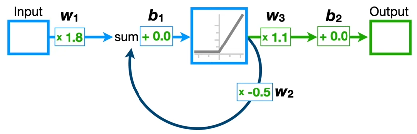
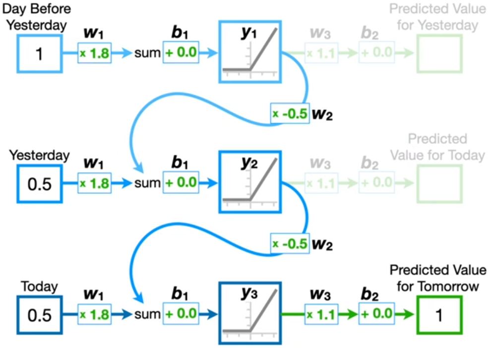
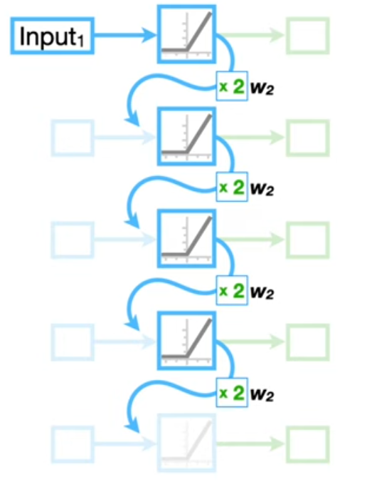

--

## Dense / Fully Connected Neural Networks

> A dense neural network, often referred to as a fully connected network, is a type of artificial neural network where **each neuron in one layer is connected to every neuron in the next layer**. These connections allow the network to *learn complex patterns and relationships from the input* data through a process of weighted inputs, biases, and activation functions.

<small style="font-size:xx-small"> [Dense NN Example](https://colab.research.google.com/drive/1-0RsBldZ0KlCeP6O4BeuPbB4Zi6tZn73?usp=sharing) </small>

--

## Convolutional Neural Networks 

> A Convolutional Neural Network (CNN) is a type of artificial neural network designed to **process data with a grid-like topology**, such as images. CNNs are particularly powerful for tasks that involve spatial data, like image and video recognition, image classification, and also applications in areas beyond vision, such as audio processing and natural language processing.

<small style="font-size:xx-small"> [CNN Explainer](https://poloclub.github.io/cnn-explainer/) </small>

Notes:
- Specialized kind of neural network for processing data with a grid-like topology
- Particularly useful in image recognition/classification and processing
- Utilizes convolutional layers, pooling layers, and fully connected layers

--

<!-- .slide: class="align-center" -->

## Recurrent Neural Networks 

    
    

[Introduction to Recurrent Neural Network](https://www.geeksforgeeks.org/introduction-to-recurrent-neural-network/) <!-- .element: style="font-size:xx-small" -->
[Recurrent Neural Networks and LSTM explained](https://medium.com/@lchandratejareddy/recurrent-neural-networks-and-lstm-explained-7871f3c5ac00) <!-- .element: style="font-size:xx-small" -->
<!-- .element: style="float:right" -->

Notes:
- RNNs are networks with loops, allowing information to persist
- **RNN Structure:** RNNs are distinguished from other neural network architectures by their unique feedback loops, allowing them to process sequential data over time. This structure enables RNNs to use information from previous inputs to influence future predictions, a crucial feature for analyzing temporal data.
- **Sequential Data Handling:** Unlike other neural networks that require a fixed number of input and output values, RNNs excel in dealing with varying amounts of sequential data. This ability makes them ideal for tasks like stock price prediction, where the input data consists of time-series information.
- Vanishing / Exploding Gradient Problem (Hard Training)
- **Shared Weights and Biases**: An important aspect of RNNs is the sharing of weights and biases across all time steps. This feature ensures that the model remains compact and manageable, regardless of the number of inputs.
- **Challenges with RNNs**: Despite their advantages, RNNs face challenges, such as the **Vanishing and Exploding Gradient Problem**, which complicates the training process. Long Short-Term Memory Networks (LSTMs) provide a solution to this problem.

--

<!-- .slide: class="align-center" -->

## Recurrent Neural Networks - Example

    
    
    
    
    

[Recurrent Neural Networks (RNNs), Clearly Explained!!!](https://www.youtube.com/watch?v=AsNTP8Kwu80) <!-- .element: style="font-size:xx-small" -->
<!-- .element: style="float:right" -->

Notes:
- We want to predict the next value in a sequence e.g. the stock market from 2 different sources using the same RNN; the sequence has variable length 
- A RNN has the same shape of a NN: layers, weights and biases. The only difference is the feedback loop
- We plug in values from the first to the last before the one we want to predict
- we ignore outputs from all cells but the last one, which is the prediction
- Note that the RNN shares the same weights and biases for each step

--

<!-- .slide: class="align-center" -->

## Recurrent Neural Networks - Exploding / Vanishing Problem

    
    
    

[Recurrent Neural Networks (RNNs), Clearly Explained!!!](https://www.youtube.com/watch?v=AsNTP8Kwu80) <!-- .element: style="font-size:xx-small" -->

Notes:
- It is okay using RNN for short variable lenght inputs, but becomes very hard to train when input lenghts increase
- This is called the Exploding / Vanishing Problem
- Let's say the input lenght we have is 50 elements; so the RNN is replicated 50 times and the last one receives a value multiplied by the weight in the loop 50 times
- If the weight at this step is higher than 1, than the value reaching this point in the path may become really high - So the gradient, which should move the research of a minimum of the cost function towards a convergence, will make the algorithm take a step too big and never reach the end
- The same thing happens if the feedback weight is lower than 1, but this time the steps to reach the minimum of the cost function would be too small and never reach the end

--

<!-- .slide: class="align-center" -->

## Long Short-Term Memory 

    
    

<small style="font-size:xx-small"> [Recurrent Neural Networks and LSTM explained](https://medium.com/@lchandratejareddy/recurrent-neural-networks-and-lstm-explained-7871f3c5ac00) </small>

Notes:
- LSTM cells not as simple as RNN cell
- Solve Vanishing / Exploding Gradient Problem thanks to the Long term memory path ( no weights and biases are are used to process values flowing into this path )
- LSTM is a special kind of RNN capable of learning long-term dependencies

--

<!-- .slide: class="align-center" -->

## Long Short-Term Memory - Details

    
    
    

<small style="font-size:xx-small"> [Long Short-Term Memory (LSTM), Clearly Explained](https://www.youtube.com/watch?v=YCzL96nL7j0) </small>

Notes:

--

## Backpropagation and Gradient Descent (1)

<!-- .slide: class="align-center" -->

<iframe width="560" height="315" src="https://www.youtube.com/embed/qg4PchTECck?si=bNstj66ekc-R-Ucf" title="YouTube video player" frameborder="0" allow="accelerometer; autoplay; clipboard-write; encrypted-media; gyroscope; picture-in-picture; web-share" referrerpolicy="strict-origin-when-cross-origin" allowfullscreen></iframe>

Notes:
- Backpropagation: Method for calculating the gradient of the loss function with respect to each weight by the chain rule
- Gradient Descent: Optimization algorithm to adjust the parameters to minimize the loss function
- These methods allow the network to learn from its mistakes

--

## Backpropagation and Gradient Descent (2)

<!-- .slide: class="align-center" -->

Notes:
